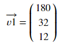

# Introduction to Vector Algebra using Python

## What are vectors?
Vectors are essentially objects that have a magnitude and a direction. In physics, vectors are visualised as directed line segments in a vector space(collection of vectors) whose length is the magnitude and the arrow indicates the direction.

In data science, vectors are defined as points in a finite-dimensional space which can represent numeric data. For example, if an E-commerce website has data about their customers like shoe size, waist size and height, it can be represented as a collection of three dimensional vectors(shoe size, waist size, height). Below is a vector representing a height of 180cm, a waist size of 32cm and a UK 12 as shoe size.

## What is Numpy?
Numpy is a numeric computing library for python that provides support for multi-dimensional arrays and matrices, along with associated mathematical functions. Numpy arrays can be represented as vectors. Copy the code below to the editor to represent the above vector using a numpy array:

<pre class="file" data-filename="vector.py" data-target="replace">
# Importing numpy
import numpy as np
# Create array using numpy
v1 = np.array([[180],
               [32],
               [12]])
# Print array to terminal
print(v1)
</pre>

Read the comments in the above code for better understanding. You can run `vector.py` using the following command:
`python3 vector.py`{{execute}}

Copy the code below to the editor to represent the above vector in an alternate way:

<pre class="file" data-filename="vector.py" data-target="replace">
import numpy as np
# Another way to represent an array
v1 = np.array([180,32,12])
print(v1)
</pre>

Run `vector.py` using the following command:
`python3 vector.py`{{execute}}