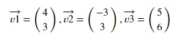

# Vectors and coordinate system
Vectors are plotted using coordinate system. In geometry, coordinate system uses one or more numbers, or coordinates, to determine the position of the points or other geometric elements on a manifold like Euclidean space. On a euclidean space, a vector v = (2,3) can be represented as 2 units on x-axis and 3 units on y-axis. Similarly, a vector w = (2,3,4) can be represented as 2 units on x-axis, 3 units on y-axis and 4 units on z-axis.

## Zero vector
A vector is called a zero vector if all its elements are 0. This is also represented by the origin on the coordinate system. 

## Plotting a vector using Matplotlib
Matplotlib is a data visualization library for python that can be used to visualize vectors.

Vectors are represented as arrows while plotting their positions on a graph. Matplotlib offers quiver plot to plot vectors. Quiver plot accepts the location and directions of the vectors as its parameters.

First, let's plot some vectors in 2 dimensions.

Copy the following code to the editor:

<pre class="file" data-filename="vector.py" data-target="replace">
# Import the matplotlib library
import matplotlib.pyplot as plt
# Define origin or location
# This is defined tuple of lists
origin = [0],[0]
# Define vectors in same manner
v1 = [4],[3]
v2 = [-3],[3]
v3 = [5],[6]
# Plotting the 3 vectors with matplotlib.quiver
plt.quiver(*origin, *v1, color='r', units='xy', angles='xy', scale_units='xy', scale=1, label='v1 = [4,3]')
plt.quiver(*origin, *v2, color='b', units='xy', angles='xy', scale_units='xy', scale=1, label='v2 = [-3,3]')
plt.quiver(*origin, *v3, color='g', units='xy', angles='xy', scale_units='xy', scale=1, label='v3 = [5,6]')
# units, angles, scale_units and scale are used to scale the graph. Below, the xlim and ylim are also used for the same purpose.
plt.xlim(-8, 8)
plt.ylim(-8, 8)
# Setting location for legend
plt.legend(loc=2)
plt.xlabel('X')
plt.ylabel('Y')
plt.title("2D representation of vectors")
# Saving image as a PNG file
plt.savefig('2Dvectors.png')
plt.show()
</pre>

Run `vector.py` using the following command:
`python3 vector.py`{{execute}}

Click and view the newly formed `2Dvectors.png` file from the VScode sidebar.

