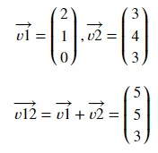
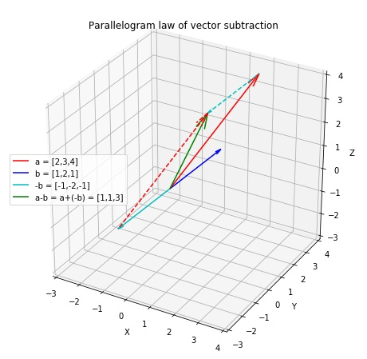

## Vector Addition
Two or more vectors can be added to form a new vector. For two vectors v1 and v2, v1 + v2 is obtained by placing the two vectors head to tail and drawing the resultant vector from the free tail to the free head. This is the parallelogram law of vector addition. If v1 and v2 are two adjacent sides of a parallelogram, then the diagonal through the common point represent their sum in both magnitude and direction. 

In the coordinate system, vector addition is obtained by simply adding the corresponding elements of two vectors. Given two vectors,

Let's try vector addition in Numpy. Copy the following code to the editor:

<pre class="file" data-filename="vector.py" data-target="replace">
# Importing numpy
import numpy as np
v1 = np.array([2,1,0])
v2 = np.array([3,4,3])
# Simple addition
v12 = v1 + v2
print("v12 = v1 + v2",v12)
</pre>

Run `vector.py` using the following command:
`python3 vector.py`{{execute}}

Below is the quiver plot for parallelogram law of vector addition.

