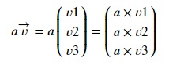
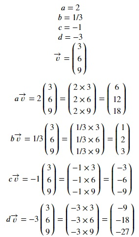
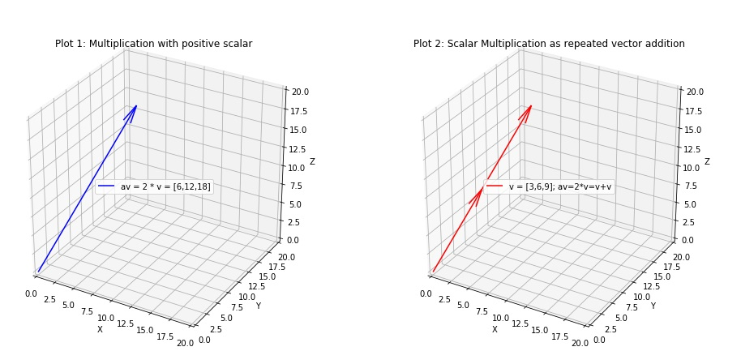
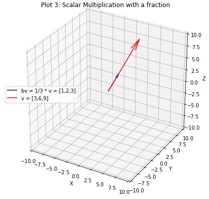
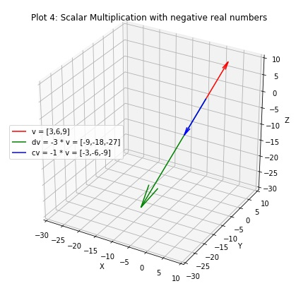

## Scalar multiplication of vectors
A scalar is a real number that unlike vectors, only has magnitude and no direction. Vectors can be multiplied by a scalar. This results in a vector and this process is called Scalar Multiplication. The name "scalar" is derived from its usage: one that scales a vector. Given a scalar real number `a` and a vector v,

Let's see some examples.

Now, we convert the above examples to numpy code. Copy the following code to the editor:

<pre class="file" data-filename="vector.py" data-target="replace">
# Importing numpy
import numpy as np
# Create vector
v =  np.array([3,6,9])
print("Vector v =",v)
# Define the scalars
a, b, c, d = 2, 1/3, -1, -3
print("a = {}, b = {}, c = {}, d = {}".format(a,"1/3",c,d))
# Perform scalar multiplication for all scalars
av = a * v
bv = b * v
cv = c * v
dv = d * v
# Print results
print("av = a * v =",av)
print("bv = b * v =",bv)
print("cv = c * v =",cv)
print("dv = d * v =",dv)
</pre>

Run `vector.py` using the following command:
`python3 vector.py`{{execute}}

#### Some rules of thumb for Scalar Multiplication
Essentially scalar multiplication enables all elements of the vector to be individually multiplied by the scalar. Therefore, here are some general rules:
* Vector remains the same if scalar multiplication is done with +1.
* Scalar multiplication with any positive integer other than 1 changes the magnitude of the vector but the direction remains the same. (Click the image below to zoom in for a better view)

* Scalar multiplication with any real number between -1 and 1, i.e., fractions decreases the magnitude of the vector.

* Scalar multiplication with any real number less than -1 and greater than 1 increases the magnitude of the vector.
* Scalar multiplication with -1 reverses the direction of the vector but the magnitude remains the same.

* Scalar multiplication any other negative integer reverses the direction of the vector and also changes the magnitude.