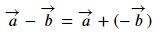
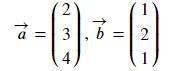
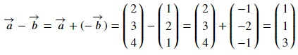
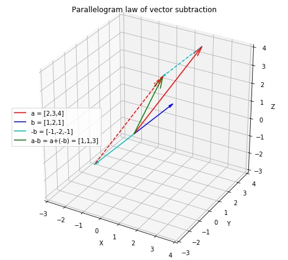

## Vector Subtraction
Vector subtraction results in subtraction of one vector from the other. Given two vectors `a` and `b`,

This shows that it is a special scenario of vector addition of a and b but the direction of b is reversed.

Now,

Let's try this out in numpy. Copy the following code to the editor:

<pre class="file" data-filename="vector.py" data-target="replace">
# Importing numpy
import numpy as np
a = np.array([2,3,4])
b = np.array([1,2,1])
# Vectors subtracted through simple subtraction
c = a - b
print("c = a - b =",c)
</pre>

Run `vector.py` using the following command:

`python3 vector.py`{{execute}}

Below is the quiver plot for parallelogram law of vector subtraction.

