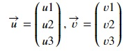
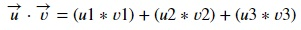

## Dot Product
Dot product or scalar product is the sum of the products of corresponding elements of two vectors. Given two vectors,

The dot product of the above vectors will be:

Let's see an example using numpy. Copy the following code to the editor:

<pre class="file" data-filename="vector.py" data-target="replace">
# Importing numpy
import numpy as np
# Create 2 vectors
u = np.array([1,2,3])
v = np.array([3,5,-2])
# An example of sum of products of corresponding elements of both vectors
print("The sum of products of corresponding elements = 1*3 + 2*5 + 3*(-2) =", u[0]*v[0] + u[1]*v[1] + u[2]*v[2])
# Calculate dot product using dot() method and compare with the above result
print("The dot product of u and v =",np.dot(u,v))
</pre>

Run `vector.py` using the following command:
`python3 vector.py`{{execute}}

## Cross Product
The cross product of two vectors `u` and `v` is a vector with a direction perpendicular to both vectors `u` and `v`. Vector `u x v` lies in a plane perpendicular to the plane in which vectors `u` and `v` lie.

Here's an example in numpy. Copy the following code to the editor:

<pre class="file" data-filename="vector.py" data-target="replace">
import numpy as np
u = np.array([1,0,3])
v = np.array([3,0,-2])
cross_product = np.cross(u,v)
print(cross_product)
</pre>

Run `vector.py` using the following command:
`python3 vector.py`{{execute}}

Let's plot out the quiver plot of these vectors and their cross product. Copy the following code to the editor:

<pre class="file" data-filename="vector.py" data-target="replace">
import matplotlib.pyplot as plt
# mplot3d for 3D plots
from mpl_toolkits.mplot3d import Axes3D

# Create matplotlib figure
fig = plt.figure(figsize=(8,8))

# Define origin or location
# This is defined tuple of lists
origin = [0],[0],[0]
# Define vectors in same manner
u = [1],[0],[3]
v = [3],[0],[-2]
uxv = [0],[11],[0]

# projection='3d' for a three-dimensional graph
ax = fig.add_subplot(111, projection='3d')

# Plotting the 3 vectors with matplotlib.quiver
ax.quiver(*origin, *u, color='r', label='u = [1,0,3]', arrow_length_ratio=0.2)
ax.quiver(*origin, *v, color='b', label='v = [3,0,-2]', arrow_length_ratio=0.1)
ax.quiver(*origin, *uxv, color='g', label='u x v = [0,11,0]', arrow_length_ratio=0.1)

ax.set_xlabel('X')
ax.set_ylabel('Y')
ax.set_zlabel('Z')
ax.set_xlim(-6,6)
ax.set_ylim(-6,6)
ax.set_zlim(-6,6)
ax.legend(loc=6)
plt.title("Plotting cross product")
# Saving image as a PNG file
plt.savefig("cross_product.png", dpi=300)
plt.show()
</pre>

Click and view the newly formed `cross_product.png` file from the VScode sidebar. Clearly, `u x v` lies in a plane perpendicular to the plane in which vectors `u` and `v` lie.
