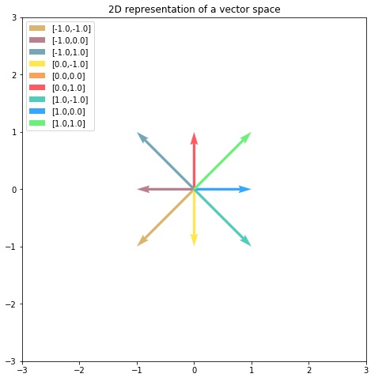
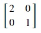

## Understanding eigenvalues and eigenvectors using Python
The word 'eigen' in German language means 'own', 'inherent' or 'characteristic'. Therefore, eigenvectors are special vectors associated with a linear system of equations and are known as its characteristic vectors or proper vectors. Each eigenvector has a corresponding eigenvalue.

Eigenvectors and eigenvalues are very important in the fields mathematics and physics and are essential for stability analysis, physics of rotating bodies, small oscillations of vibrating systems, etc. and in data science for prinipal component analysis, image compression, topic modelling, etc.

We will visual examples of vector spaces to understand eigenvectors and eigenvalues. Given is a plot of 9 vectors(8 vectors are shown as zero vector has no magnitude) in a vector space where all elements of a vector lie between -1 and 1.

We will apply linear transformations on the vectors in the above plot to understand eigenvectors and eigenvalues. 

### Eigenvalues and eigenvectors for a horizontal scaling matrix
Let's start with horizontal scaling. For this, we will apply(multiply) the following transformation matrix to each vector:

Let's see how this transformation matrix changes our vectors by plotting the transformed vectors using numpy. Copy the following code to the editor:

<pre class="file" data-filename="vector.py" data-target="replace">
# Importing numpy and matplotlib
import numpy as np
import matplotlib.pyplot as plt
# Define origin or location
# This is defined tuple of lists
origin = [0],[0]
# We need these arrays to create the 9 vectors
x = [-1,0,1]
y = [-1,0,1]
colors = ["#ddb46d","#ba808e","#75a6b7","#ffe74c","#ffa058","#ff5964","#50ccbc","#35a7ff","#6bf178"] # for distinguishing vectors
gen = 0 # counter for iterating over colors
m = np.matrix([[2,0],[0,1]]) # Transformation matrix for horizonal scaling
plt.figure(figsize=(8,8))
# This nested loop creates 9 vectors
for i in x:
  for j in y:
    # Create vector from x and y 
    v = [float(i)],[float(j)]
    # Scaling
    r = m @ v 
    r = [float(r[0])],[float(r[1])]
    # Plot it with a unique color
    plt.quiver(*origin, *r, color=colors[gen], units='xy', angles='xy', scale_units='xy', scale=1, 
               label='[{},{} -> {},{}]'.format(i,j,r[0][0],r[1][0]))
    gen = gen + 1 # Increment color index
plt.xlim(-3, 3)
plt.ylim(-3, 3)
# Define aspect ratio for uniform plotting
plt.gca().set_aspect('equal', adjustable='box')
plt.legend(loc=2)
plt.title("2 times horizontally scaled vector space")
plt.savefig('plot1.png')
plt.show()
</pre>

Run `vector.py` using the following command:

`python3 vector.py`{{execute}}  (This code doesn't produce any output on the terminal.)

Click and view the newly formed `plot1.png`{{open}} file from the VScode sidebar.

As you can see in the legend of the above plot, the red and yellow vertical vectors have retained both their magnitude and direction, i.e., they didn't change at all. The brown and sky blue horizontal vectors only retained their direction. Other vectors retained neither magnitude nor direction.

Therefore, the horizontal and vertical vectors are eigenvectors for the transformation matrix that horizontally scales the vector by a factor of 2. The vertical vectors didn't change at all so their eigenvalues are 1. As the magnitude of the horizontal vectors was doubled, their eigenvalues are 2.

Numpy provides `numpy.linalg.eig()` method to get eigenvalues and eigenvectors of a given matrix. Let's verify our answer with numpy. Copy the following code to the editor:

<pre class="file" data-filename="vector.py" data-target="replace">
# Importing numpy
import numpy as np

m = np.matrix([[2,0],[0,1]]) # Transformation matrix for horizonal scaling

# Get eigenvalues and eigenvectors using np.linalg.eig() method
e_values, e_vectors = np.linalg.eig(m)

# Print eigenvalues and eigenvectors
print("Eigenvalues:",e_values)
print("Eigenvectors:")
print(e_vectors.astype(int))
</pre>

Run `vector.py` using the following command:

`python3 vector.py`{{execute}}

Vector (1,0) has eigenvalue 2 and as (-1,0) can be created by using scalar multiplication on (1,0), (-1,0) is also an eigenvector. These are above mentioned horizontal vectors.

Vector (0,1) has eigenvalue 1 and as (0,-1) can be created by using scalar multiplication on (0,1), (0,-1) is also an eigenvector. These are above mentioned vertical vectors.

Next, we will see some more examples that use vertical shear and rotation.