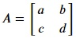
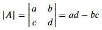
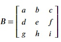
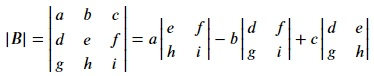
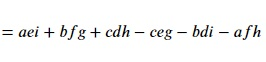

## What is the determinant of a matrix?
According to Wikipedia, Determinant is a scalar value computed from the elements of a square matrix that encodes certain properties of the linear transformation described by the matrix. It captures how linear transformations change area or volume and is also useful in solving linear equations. The determinant of a square matrix A is denoted as det(A), det A or |A|.

Given a 2 × 2 matrix A,

We can calculate its determinant using simple cross-multiplication.

Given a 3 × 3 matrix B,

Therefore,

Numpy's `numpy.linalg.det()` method gives us the determinant of a matrix. We will compare the above cross-multiplication based approach with the numpy approach. Copy the following code to the editor:

<pre class="file" data-filename="equation.py" data-target="replace">
# Importing numpy
import numpy as np
# Create matrix A22 using numpy
A22 = np.matrix([[1,2],
                [3,4]])
# Comparing results of the above mathematical approach and numpy
print("Cross Multiplication of elements = 1*4 - 2*3 =",A22[0,0]*A22[1,1] - A22[0,1]*A22[1,0])
print("Using numpy, determinant of A22 =",int(np.linalg.det(A22))) # converted to int for simplicity
</pre>

Run `equation.py` using the following command:

`python3 equation.py`{{execute}}

Both approaches should return the same result.