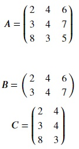

## What is a matrix?
According to Wikipedia: "In mathematics, a matrix (plural matrices) is a rectangular array of numbers, symbols, or expressions, arranged in rows and columns." Matrices are essentially two-dimensional arrays. Here, A is a 3 × 3 matrix i.e., it has 3 rows and 3 columns. Also, B is a 2 × 3 matrix i.e., B has 2 rows and 3 columns and C is a 3 × 2 matrix, having 3 columns and 2 rows.   

Essentially, you can count the number of rows in a matrix by counting the horizontal lines of numbers from up to down. Similarly, you can count the number of columns in a matrix by counting the vertical lines of numbers from left to right.

## What is Numpy?
Numpy is a numeric computing library for python that provides support for multi-dimensional arrays and matrices, along with associated mathematical functions. Numpy arrays can be represented as matrices. Copy the code below to the editor to represent the above matrices using numpy arrays:

<pre class="file" data-filename="matrix.py" data-target="replace">
# Importing numpy
import numpy as np
# Create matrix A using numpy
A = np.matrix([[2,4,6],
             [3,4,7],
             [8,3,5]])
# Create matrix B using numpy
B = np.matrix([[2,4,6],
             [3,4,7]])
# Create matrix C using numpy             
C= np.matrix([[2,4],
             [3,4],
             [8,3]])
# Print the matrices
print("Matrix A:")
print("\n",A,"\n")
print("Matrix B:")
print("\n",B,"\n")
print("Matrix C:")
print("\n",C,"\n")
</pre>

Read the comments in the above code for better understanding. You can run `matrix.py` using the following command:

`python3 matrix.py`{{execute}}