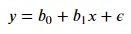
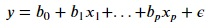
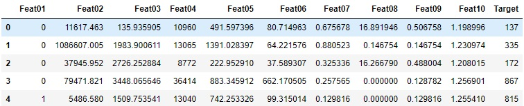

### What is linear regression?
Linear regression attempts to find a relationship between a dependent variable and one or more explanatory (or independent) variables. In case of simple linear regression where there is only one explanatory variable, linear regression is described as a general equation as shown below:

where y is the dependent variable, x is the explanatory variable with coefficient b1, and b0 is the intercept with the error term 𝜖.

For multiple linear regression, we have two or more explanatory variables. It is described as a general equation as shown below:

where y is the dependent variable, x1...xp are the explanatory variables with regression coefficients b1...bp, and b0 is the intercept with the error term 𝜖.

### About the dataset
This is a simulated dataset made for teaching regression containing 10 independent variables named `Feat01`, `Feat02`..., `Feat10` and a dependent variable called `Target`. The dataset is stored in a CSV file called `data.csv`.

### The task
The task at hand is to predict the `Target` variable such that the values of predictions are as close to the actual values as possible. This will be done using a baseline linear regression model.

### Reading data
First, we will read the data from the CSV file using pandas and then preview it. Copy the following code to the editor: 

<pre class="file" data-filename="lr.py" data-target="replace">
# Importing pandas
import pandas as pd
# Reading the csv file using pandas 
data = pd.read_csv("data/data.csv")
# Showing first five rows of the dataset
print(data.head())
</pre>

Run `lr.py` using the following command:

`python3 lr.py`{{execute}}

The above code should output the first five rows of the dataset as a preview. Following is a better view of this preview:

Now, let's divide the data into dependent and independent variables. Copy the following code to the editor:

<pre class="file" data-filename="lr.py" data-target="replace">
# Importing pandas
import pandas as pd
# Reading the csv file using pandas 
data = pd.read_csv("data/data.csv")

# Printing shape of data
print("Shape of data:", data.shape)

# Extracting Independent variables
X = data.drop(["Target"],axis=1) # Drop the target variable, retain all other variables
print("Shape of independent variables:", X.shape)

# Extracting Dependent variable
y = data["Target"] # Select only the target variable
print("Shape of dependent variable:", y.shape)
</pre>

Run `lr.py` using the following command:

`python3 lr.py`{{execute}}

The output of the above code shows that the dataset has 10000 rows and 11 columns. On dividing the dataset into dependent and independent variables, the set of independent variables i.e., `X` has 10000 rows and 10 columns(the 10 features) and the remaining column is our dependent variable `y` as shown by their respective shapes.