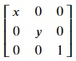

## Affine Transformations
According to Wikipedia, an affine transformation is a geometric transformation that preserves lines and parallelism (but not necessarily distances and angles). Basically, we are applying a linear transormation to a image in order to result in one or more manipulations like rotation, skewing, scaling, etc. 

Suppose, we think of an image as a vector space (collection of vectors bound by conditions and properties). Applying a linear transformation to this vector space involves matrix multiplication of a transformation matrix with each vector in the vector space. This results in a new vector space with new conditions and hence, a new image. Let's see some examples.

### Scaling an image
We can increase the size of our images by scaling. We can stretch the image horizontally, vertically, or both at the same time. Following is the transformation matrix for scaling:

Here, x and y are the scale factor by which vertical and horizontal scaling are done respectively. Eg., x = 1 means no change. If x = 2, the image has double the number of pixel rows. Let's try vertical scaling by a factor of 2. Copy the following code to the editor:

<pre class="file" data-filename="la.py" data-target="replace">
# Importing libraries
import numpy as np
import matplotlib.pyplot as plt
from PIL import Image

# Loading image
img = Image.open("./images/img1.jpg") 
img.load()

# Image as a matrix
img_data = np.asarray(img, dtype="int32")

# Transformation matrix for 2x vertical scaling
T = np.array([[2, 0, 0],
              [0, 1, 0],
              [0, 0, 1]])

# Empty array is used for storing transformed data
# First element of array's shape is twice the original size
# to accomodate the 2x vertically scaled image
img_transformed = np.empty((img_data.shape[0]*2, img_data.shape[1], img_data.shape[2]), dtype=np.uint8)

# Iterating over the whole image matrix to transform each element
for i, row in enumerate(tqdm(img_data)):
    for j, col in enumerate(row):
        # Getting original data
        pixel_data = img_data[i, j, :]
        input_coords = np.array([i, j, 1])
        # Performing linear transformation using matrix multiplication
        i_out, j_out, _ = T @ input_coords
        # Storing transformed data
        img_transformed[i_out, j_out, :] = pixel_data

plt.figure(figsize=(5, 5))
plt.imshow(img_transformed)
plt.savefig("image2.jpg") # Saving image as a file
</pre>

Run `la.py` using the following command:

`python3 la.py`{{execute}} (This code doesn't produce any output in the terminal.)

Click and open the newly formed `image2.jpg`{{open}} in the VScode sidebar to view the newly formed image. We can see that the y-axis of the new image is two times that of the original image. Due to scaling the image, we have lost some data. This is seen in the form of dark horizontal lines.