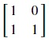

### Eigenvalues and eigenvectors for a vertical shear matrix
Now, let's see an example with skewing. For this, we will apply(multiply) the following transformation matrix to each vector:

Let's see how this transformation matrix changes our vectors by plotting the transformed vectors using numpy. Copy the following code to the editor:

<pre class="file" data-filename="vector.py" data-target="replace">
# Importing numpy and matplotlib
import numpy as np
import matplotlib.pyplot as plt
# Define origin or location
# This is defined tuple of lists
origin = [0],[0]
# We need these arrays to create the 9 vectors
x = [-1,0,1]
y = [-1,0,1]
colors = ["#ddb46d","#ba808e","#75a6b7","#ffe74c","#ffa058","#ff5964","#50ccbc","#35a7ff","#6bf178"] # for distinguishing vectors
gen = 0 # counter for iterating over colors
m = np.matrix([[1,0],[1,1]]) # Transformation matrix for vertical shear
plt.figure(figsize=(8,8))
# This nested loop creates 9 vectors
for i in x:
  for j in y:
    # Create vector from x and y 
    v = [float(i)],[float(j)]
    # Vertical shear
    r = m @ v 
    r = [float(r[0])],[float(r[1])]
    # Plot it with a unique color
    plt.quiver(*origin, *r, color=colors[gen], units='xy', angles='xy', scale_units='xy', scale=1, 
               label='[{},{} -> {},{}]'.format(i,j,r[0][0],r[1][0]))
    gen = gen + 1 # Increment color index
plt.xlim(-3, 3)
plt.ylim(-3, 3)
# Define aspect ratio for uniform plotting
plt.gca().set_aspect('equal', adjustable='box')
plt.legend(loc=2)
plt.title("Vertical shear, k = 1")
plt.savefig('plot2.png')
plt.show()
</pre>

Run `vector.py` using the following command:

`python3 vector.py`{{execute}}  (This code doesn't produce any output on the terminal.)

Click and view the newly formed `plot2.png`{{open}} file from the VScode sidebar.

Compare this plot with the original plot of the vectors given below:

In the newly-generated plot, only the red and yellow vertical vectors retain their magnitude and direction, hence they are eigenvectors for the vertical shear matrix and their eigenvalues are 1. All other vectors neither retained their magnitude nor direction.

Let's verify our answer with numpy. Copy the following code to the editor:

<pre class="file" data-filename="vector.py" data-target="replace">
# Importing numpy
import numpy as np

m = np.matrix([[1,0],[1,1]]) # Transformation matrix for vertical shear

# Get eigenvalues and eigenvectors using np.linalg.eig() method
e_values, e_vectors = np.linalg.eig(m)

# Print eigenvalues and eigenvectors
print("Eigenvalues:",e_values)
print("Eigenvectors:")
print(e_vectors.astype(int))
</pre>

Run `vector.py` using the following command:

`python3 vector.py`{{execute}}

Numpy implementation also proves that both (0,1) and (0,-1) are eigenvectors with eigenvalues of 1 and are represented by the red and yellow vertical vectors on the above graph.

Now, let's see an example with 90° counter-clockwise rotation.