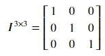
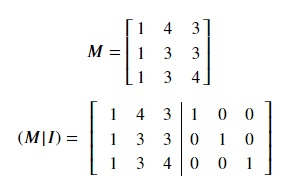

## Identity matrix
An identity matrix is a square matrix having ones on the main diagonal and zeros elsewhere. Following is a 3 × 3 identity matrix:

The resultant matrix from matrix multiplication of any matrix with its equivalent identity matrix is the matrix itself.

## Inverse of a matrix
According to Wikipedia, a square matrix is called invertible, if there exists a square matrix B such that

**AB = BA = I**

where I is the identity matrix. Here, B is the multiplicative inverse of A, denoted by A-1. Therefore,

**AA-1 = A-1A = I**

### Finding inverse of a matrix using Gauss-Jordan elimination method
In Gauss-Jordan elimination method, an invertible matrix M is augmented by concatenating M with its equivalent identity matrix side-by-side. Then, elementary operations are performed on the augmented matrix in order to transform M into the identity matrix. Consequently, the identity matrix on the right is converted into the inverse of matrix M. 

There are three kinds of elementary operations:
* Swapping two rows
* Adding(or subtracting) a multiple of one row to the other
* Multiple one row with a non-zero scalar

Let's calculate the inverse for a 3 × 3 matrix using numpy and gaussian elimination. Following is a matrix M and the augmented matrix (M|I) to be used for gaussian elimination.

**Step 1:** Create an augmented matrix by concatenating a 3 × 3 identity matrix to matrix M.

To perform this, copy the following code to the editor: 

<pre class="file" data-filename="equation.py" data-target="replace">
# Importing numpy
import numpy as np
# Create matrix M
M = np.matrix([[1,4,3],
               [1,3,3],
               [1,3,4]])
# Augmented matrix created using numpy.concatenate
# numpy.identity creates a 3 x 3 identity matrix
MI = np.concatenate((M,np.identity(3)),axis=1)

# Printing the augmented matrix
print("Augemented matrix after Step 1:")
print(MI)
</pre>

Run `equation.py` using the following command to get results of step 1:

`python3 equation.py`{{execute}}

**Step 2:** Transform column 0 of (M|I) to column 0 of the identity matrix by subtracting row 0 from row 1 and row 2.

Append the following code to the editor: 

<pre class="file" data-filename="equation.py" data-target="append">
# Row1 = Row1 - Row0
MI[1,:] = MI[1,:] - MI[0,:]
# Row2 = Row2 - Row0
MI[2,:] = MI[2,:] - MI[0,:]

# Printing the results
print("Augemented matrix after Step 2:")
print(MI)
</pre>

Run `equation.py` using the following command to get results of step 2:

`python3 equation.py`{{execute}}

The column 0 of (M|I) resembles that of a identity matrix. The concatenated identity matrix has also been transdformed as the operations take place on the entire augmented matrix.

**Step 3:** Transform column 1 of (M|I) to column 1 of the identity matrix by subtracting row 1 from row 2. This is followed by multiplying itself by -1. Then, 4 times row 1 is subtracted from row 0.

Append the following code to the editor: 

<pre class="file" data-filename="equation.py" data-target="append">
# Row2 = Row2 - Row1
MI[2,:] = MI[2,:] - MI[1,:]
# Row1 = -1 * Row1
MI[1,:] = -1 * MI[1,:]
# Row0 = Row0 - 4*Row1
MI[0,:] = MI[0,:] - 4*MI[1,:]

# Printing the results
print("Augemented matrix after Step 3:")
print(MI)
</pre>

Run `equation.py` using the following command to get results of step 3:

`python3 equation.py`{{execute}}

**Step 4:** To transform column 2 of (M|I) to column 2 of the identity matrix, subtract 3 times row 2 from row 0.

Append the following code to the editor: 

<pre class="file" data-filename="equation.py" data-target="append">
# Row0 = Row0 - 3*Row2
MI[0,:] = MI[0,:] - 3*MI[2,:]

# Printing the results
print("Augemented matrix after Step 4:")
print(MI)
</pre>

Run `equation.py` using the following command to get results of step 3:

`python3 equation.py`{{execute}}

We have obtained the identity matrix in the first three columns of (M|I). The last three columns of (M|I) represent the inverse of M.

We have obtained the identity matrix in the first three columns of (M|I). The last three columns of (M|I) represent the inverse of M.

Step 5: Finally, extract inverse of matrix M from (M|I). This is done through slicing the augmented matrix.

Append the following code to the editor: 

<pre class="file" data-filename="equation.py" data-target="append">
# Slcing inverse matrix from the augmented matrix
M_inverse = MI[-3:,-3:]

# Printing the inverse matrix
print("Inverse of matrix M:")
print(MI)
</pre>

Run `equation.py` using the following command to get results of step 3:

`python3 equation.py`{{execute}}
