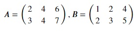
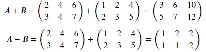

## Addition and Subtraction of matrices
As long as the dimensions of the matrices are same, the corresponding elements of matrices can be added or subtracted. Given two matrices,

Both A and B are 2 × 3 matrices. Following is a representation of addition and subtraction of these matrices:

We can do this swiftly using numpy. Copy the code below to the editor:

<pre class="file" data-filename="matrix.py" data-target="replace">
# Importing numpy
import numpy as np
# Create matrix A using numpy
A = np.matrix([[2,4,6],
             [3,4,7]])
# Create matrix B using numpy
B = np.matrix([[1,2,4],
             [2,3,5]])
# Perform addition of matrices
m_sum = A + B
# Perform subtraction of matrices
m_diff = A - B
# Print the results
print("A + B = \n")
print(m_sum)
print("______________________________________")
print("A - B = \n")
print(m_diff)
</pre>

Run `matrix.py` using the following command:

`python3 matrix.py`{{execute}}

If the shapes of the matrices are not same, they must be broadcastable to a common shape for matrix addition in numpy to be possible. Copy the code below to the editor to see an example for the same:

<pre class="file" data-filename="matrix.py" data-target="replace">
# Importing numpy
import numpy as np
# Create a matrix A using numpy
A = np.matrix([[2,4,6],
             [3,4,7]])
# Create a matrix B using numpy             
B = np.matrix([1,2,4])
print("A + B = \n")
print(A + B)
</pre>

Run `matrix.py` using the following command:

`python3 matrix.py`{{execute}}

The above operation is possible as the shape of matrix B is same as that of a row of matrix A. So, matrix B is added to each row of matrix A. 

Copy the code below to the editor to see another example:

<pre class="file" data-filename="matrix.py" data-target="replace">
# Importing numpy
import numpy as np
# Create a matrix C using numpy
C = np.matrix([[2,4,6],
             [3,4,7]])
# Create a matrix D using numpy
D = np.matrix([[1,2]])
print("C + D = \n")
print(C + D)
</pre>

Run `matrix.py` using the following command:

`python3 matrix.py`{{execute}}

The code shows an error for matrix addition as matrices C and D are not broadcastable to a common shape.