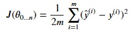
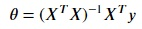

### Normal equation method
We will use normal equation method to perform linear regression from scratch. For this, we have to minimize the cost function:

where 𝑦̂(i) is the predicted result and y(i) is the expected result of the ith(from a set of m samples) sample and Ɵ0...n represent the regression coefficients(coefficients for each feature and the intercept). Since the Cost Function J(Ɵ) calculates errors of our model, so we tend to decrease it to the minimum value possible because at the lowest error, our model is the most robust and efficient.

After differentiating this equation, we get the following:

where X is the feature matrix and y is the target variable vector.

You can check the full derivation here: [Source](https://eli.thegreenplace.net/2014/derivation-of-the-normal-equation-for-linear-regression)

We can use this equation to get the best regression coefficients.

Using `X_train` as the feature matrix and `y_train` as the target variable vector, we will implement the above equation in numpy. Copy the following code to the editor:

<pre class="file" data-filename="lr.py" data-target="replace">
# Importing numpy and pandas
import numpy as np
import pandas as pd
# Reading the csv file using pandas 
data = pd.read_csv("data/data.csv")

# Extracting dependent and independent variables
X = data.drop(["Target"],axis=1)
y = data["Target"]

# Importing splitting method from Scikit-learn
from sklearn.model_selection import train_test_split
# Splitting
X_train, X_test, y_train, y_test = train_test_split(X, y,
                                                    test_size=0.3,
                                                    random_state=100,
                                                    shuffle=True)

# We have to create this equation using numpy methods and operations: (𝑋𝑇𝑋)−1𝑋𝑇𝑦
X_scratch = X_train.copy() # Making a copy of the training set so that the original training set doesn't alter
'''
The normal equation is created such that each coefficient in the model has an input of some kind to be multiplied against. A column of ones is therefore ,added to calculate the intercept term.
'''

# Adding column of ones for intercept
ones = np.ones(X_scratch.shape[0]).reshape(-1,1)
X_scratch = np.concatenate((ones,X_scratch),1)

# Calculating equation step-by-step

# 𝑋𝑇𝑋
coefs = X_scratch.transpose().dot(X_scratch)

# (𝑋𝑇𝑋)−1
coefs = np.linalg.inv(X_scratch.transpose().dot(X_scratch))

# (𝑋𝑇𝑋)−1𝑋𝑇
coefs = np.linalg.inv(X_scratch.transpose().dot(X_scratch)).dot(X_scratch.transpose())

# (𝑋𝑇𝑋)−1𝑋𝑇𝑦
coefs = np.linalg.inv(X_scratch.transpose().dot(X_scratch)).dot(X_scratch.transpose()).dot(y_train)

# Getting intercept and coefficients
intercept = coefs[0]
thetas = coefs[1:]
print("Intercept:",intercept)
print("Coefficients:",thetas.tolist())
print("_____________________")
</pre>

Run `lr.py` using the following command:

`python3 lr.py`{{execute}}

Now, we have the intercept and coefficients. Let's take the predictions.