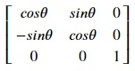

## Rotating an image
We can rotate an image clockwise or anti-clockwise using a transformation matrix. Following is the transformation matrix for rotation:

Here, 𝜃 is the degree of clockwise rotation. Let's try 90° clockwise rotation transformation on our image. Copy the following code to the editor:

<pre class="file" data-filename="la.py" data-target="replace">
# Importing libraries
import numpy as np
import matplotlib.pyplot as plt
from PIL import Image

# Loading image
img = Image.open("./images/img1.jpg") 
img.load()

# Image as a matrix
img_data = np.asarray(img, dtype="int32")

# Transformation matrix for 90° clockwise rotation
# cos𝜃 = 0, sin𝜃 = 1
T = np.array([[0, 1, 0],
              [-1, 0, 0],
              [0, 0, 1]])

# Empty array is used for storing transformed data
# First and second element of array's shape are swapped
# to accomodate the transformed image
img_transformed = np.empty((img_data.shape[1], img_data.shape[0], img_data.shape[2]), dtype=np.uint8)

# Iterating over the whole image matrix to transform each element
for i, row in enumerate(img_data):
    for j, col in enumerate(row):
        # Getting original data
        pixel_data = img_data[i, j, :]
        input_coords = np.array([i, j, 1])
        # Performing linear transformation using matrix multiplication
        i_out, j_out, _ = T @ input_coords
        # Storing transformed data
        img_transformed[i_out, j_out, :] = pixel_data

plt.figure(figsize=(5, 5))
plt.imshow(img_transformed)
plt.savefig("image5.jpg") # Saving image as a file
</pre>

Run `la.py` using the following command:

`python3 la.py`{{execute}} (This code doesn't produce any output in the terminal.)

Click and open the newly formed `image5.jpg`{{open}} in the VScode sidebar to view the newly formed image. We have successfully rotated the image.
