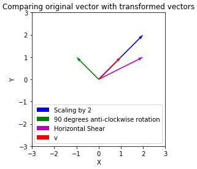

## Some special linear transformations
We can perform operations like rotation, scaling, skewing, etc. on vectors and vector spaces using special transformation matrices in our linear transformations. Following are the functions for such transformations containing these transformation matrices.

### Scaling by 2
<pre>
def scale_by_2(v):
    # Transformation matrix m
    m = np.matrix([[2,0],
                  [0,2]])
    # Matrix multiplication of transformation matrix m with our vector v
    return m @ v
</pre>

### 90 degrees rotation counter-clockwise
<pre>
def rotate_90_cc(v):
    # Transformation matrix is of the form
    # [[cos(a),-cos(a)],
    # [sin(a),cos(a)]]
    # where a is the angle of rotation
    m = np.matrix([[0,-1],
                  [1,0]])
    return m @ v
</pre>

### Horizontal shear for skewing
<pre>
def horizontal_shear(v):
    m = np.matrix([[1,1],
                  [0,1]])
    return m @ v
</pre>

Following is a visual example of applying these transformations on a vector v = (1,1).

Let's apply these transformations on entire vector spaces.

## Scaling
We can increase or decrease the size of area of vectors in vector spaces and thus the space covered by the vector space. This is done through scaling. Let's create a customizable linear transformation function for scaling and then plot the results.

### A full customizable linear transformation for scaling
<pre>
def scaling(v,h_val=1,v_val=1):
    # h_val and v_val determine the magnitude of scaling in horizontal and vertical directions respectively
    m = np.matrix([[h_val,0],
                  [0,v_val]])
    return m @ v
</pre>

Following is the vector space we plotted in Step 1. Let's see how applying the scaling transformation changes this vector space. 

Copy the following code to the editor:
<pre class="file" data-filename="vector.py" data-target="replace">
# Importing numpy and matplotlib
import numpy as np
import matplotlib.pyplot as plt

# Create scaling function
def scaling(v,h_val=1,v_val=1):
    # h_val and v_val determine the magnitude of scaling in horizontal and vertical directions respectively
    m = np.matrix([[h_val,0],
                  [0,v_val]])
    return m @ v

# Define origin or location
# This is defined tuple of lists
origin = [0],[0]

# Two arrays of 20 equally spaced elements
x = np.linspace(-1,1,num=20)
y = np.linspace(-1,1,num=20)

# This nested loop creates 400 vectors in the vector space
for i in x:
    for j in y:
        # Create vector 
        vector_v = np.matrix([[float(i)],
                              [float(j)]])
        # Scale it
        scaled_v = scaling(vector_v,h_val=3,v_val=3)
        # Transform scaled vector for plotting
        v = [float(scaled_v[0])],[float(scaled_v[1])]
        # plt.quiver plots vector
        plt.quiver(*origin, *v, color='r', units='xy', angles='xy', scale_units='xy', scale=1)
plt.xlim(-4, 4)
plt.ylim(-4, 4)
plt.xlabel('X')
plt.ylabel('Y')
# Setting aspect ratio for the plot
plt.gca().set_aspect('equal', adjustable='box')
plt.title("3 times uniformally scaled vector space")
# Saving image as a PNG file
plt.savefig('3xvs.png')
plt.show()
</pre>