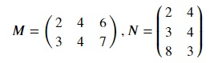
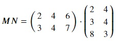
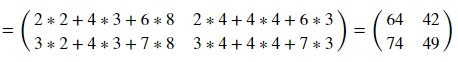

## Matrix multiplication
Matrix multiplication is a binary operation that produces a matrix from two matrices. For matrix multiplication to be possible, the number of columns in the first matrix must be equal to the number of rows in the second matrix. The resultant matrix has number of rows equal to the first matrix and number of columns equal to the second matrix.

The first element of the first row of the resultant matrix is the dot product of the first row of the first matrix and the first column of the second matrix. Similarly, the second element of the second row of the resultant matrix is the dot product of the second row of the first matrix and the second column of the second matrix. Other elements are calculated in the same manner. Given two matrices,

M is a 2 × 3 matrix and N is a 3 × 2 matrix. As number of columns in M is equal to number of rows in N, matrix multiplication is possible. After matrix multiplication, the resulting matrix product MN is a 2 × 2 matrix as M has 2 rows and N has two columns.

Let's see how we can perform matrix multiplication using numpy. Copy the code below to the editor:

<pre class="file" data-filename="matrix.py" data-target="replace">
# Importing numpy
import numpy as np
# Create matrix M using numpy
M = np.matrix([[2,4,6],
              [3,4,7]])
# Create matrix N using numpy
N = np.matrix([[2,4],
              [3,4],
              [8,3]])
# Perform matrix multiplication
MN = np.matmul(M,N)
# Print the result
print("MN =")
print(MN)
</pre>

Run `matrix.py` using the following command:

`python3 matrix.py`{{execute}}

We have some alternate ways to perform matrix multiplication using numpy. Append the code below to the existing code:

<pre class="file" data-filename="matrix.py" data-target="append">
# Alternate method 1
MN = M @ N
# Print the result
print("MN = M @ N")
print(MN)

# Alternate method 2
MN = M * N
# Print the result
print("MN = M * N")
print(MN)

# Alternate method 3
MN = np.dot(M,N)
# Print the result
print("MN = np.dot(M,N)")
print(MN)
</pre>

Run `matrix.py` using the following command:

`python3 matrix.py`{{execute}}

All these methods produce the same result.

## Scalar Matrix Multiplication
A matrix can be multiplied by a scalar term. All elements of the resultant matrix are the products of the scalar term with the elements of the original matrix. Let's see an example for scalar multiplication in numpy for a 3 × 3 matrix V and scalar integer s = 4. Copy the code below to the editor:

<pre class="file" data-filename="matrix.py" data-target="replace">
# Importing numpy
import numpy as np
# Create matrix V using numpy
V = np.matrix([[1,2,3],
              [4,5,6],
              [7,8,9]])
# Scalar entity s
s = 4
# Perform scalar multiplication
sV = s * V
# Print the result
print(sV)
</pre>

Run `matrix.py` using the following command:

`python3 matrix.py`{{execute}}