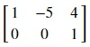
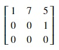
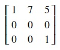
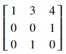
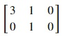

## Row echelon form
Matrices can be transformed into a simpler form like row echelon form which makes it easier to solve linear equations using the matrices. For a matrix to be in row echelon form, three conditions have to be met. Following are the three conditions:
* Starting from the left and moving right, the leading entry in each row of the matrix is 1. Leading entry is the first non-zero entry in a row.
* Every leading 1 in the matrix must be to the right of the leading 1 above it.
* Rows with all zeros are located below all the non-zero rows.

Following is a quiz on the topic of row echelon form. You have to determine whether a given matrix is in row echelon form. You can't proceed to the next step till you have successfully answered all questions. So, keep trying until you get all the answers correct.

>>Q1: Does the above matrix satisfy all three conditions of row echelon form?<<
(*) Yes
() No

>>Q2: Does the above matrix satisfy all three conditions of row echelon form?<<
(*) Yes
() No

>>Q3: Does the above matrix satisfy all three conditions of row echelon form?<<
(*) Yes
() No

>>Q4: Does the above matrix satisfy all three conditions of row echelon form?<<
() Yes
(*) No

>>Q5: Does the above matrix satisfy all three conditions of row echelon form?<<
() Yes
(*) No

>>Q6: Does the above matrix satisfy all three conditions of row echelon form?<<
() Yes
(*) No