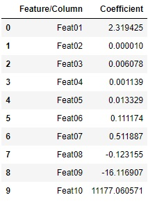

### Training a linear regression model
We will train a linear regression model using all ten available features. The `fit()` method of the `LinearRegression` class trains models and estimates the best possible intercept and coefficient(s).

Let's train our model. Copy the following code to the editor:

<pre class="file" data-filename="lr.py" data-target="replace">
# Importing pandas
import pandas as pd
# Reading the csv file using pandas 
data = pd.read_csv("data/data.csv")

# Extracting dependent and independent variables
X = data.drop(["Target"],axis=1)
y = data["Target"]

# Importing splitting method from Scikit-learn
from sklearn.model_selection import train_test_split
# Splitting
X_train, X_test, y_train, y_test = train_test_split(X, y,
                                                    test_size=0.3,
                                                    random_state=100,
                                                    shuffle=True)

# Fitting a linear model
from sklearn.linear_model import LinearRegression
model = LinearRegression()
# Training our model
model.fit(X_train,y_train)

# Printing intercept
print("Intercept:",model.intercept_)

# Printing coefficients for the given features using a pandas dataframe
model_coefs = pd.DataFrame({'Feature/Column': list(X.columns), 'Coefficient': model.coef_})
print(model_coefs)
</pre>

Run `lr.py` using the following command:

`python3 lr.py`{{execute}}

The above code prints the intercept and a table of feature names with their respective coefficients calculated by the model. Below is a neater view of the table.

Looking at the value of coefficients, we can say that for this model, the feature `Feat02` is not a good predictor due to its very low value and can be removed without affecting the results.