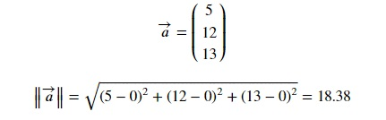
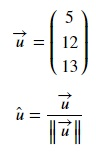

## Magnitude of a vector
Magnitude of a vector is the length of a vector. Magnitude of a vector `a` is denoted as ||a||. It is calculated using the distance formula. Below, we have calculated the magnitude of a vector with respect to the origin. Here, magnitude is the root of sum of squares of differences of elements of the vector with the origin.

Let's try the same in numpy. Copy the following code to the editor:

<pre class="file" data-filename="vector.py" data-target="replace">
# Importing numpy
import numpy as np
# Create vector
v1 = np.array([5,12,13])
# Calculate magnitude using linalg.norm() method
magnitude = np.linalg.norm(v1)
print("Magnitude:",magnitude)
</pre>

Run `vector.py` using the following command:

`python3 vector.py`{{execute}}

## Unit vector
Unit vector of a vector `u` is a vector that has the same direction as `u` and has a magnitude of 1 unit.

<pre class="file" data-filename="vector.py" data-target="replace">
# Importing numpy
import numpy as np
# Create vector
v1 = np.array([5,12,13])
# Calculate magnitude using linalg.norm() method
v1_mag = np.linalg.norm(v1)
# Calculate unit vector
v1_unit = v1 / v1_mag
print("Unit vector:",v1_unit)
</pre>

Run `vector.py` using the following command:

`python3 vector.py`{{execute}}