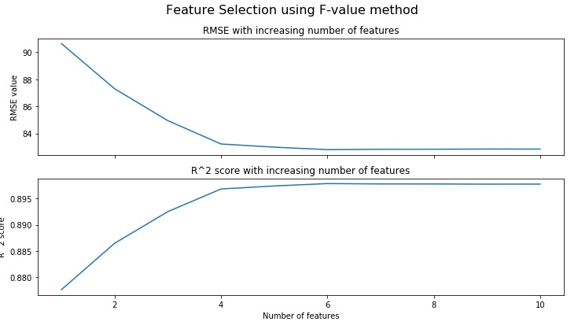

### Feature Selection
We have simply trained our model on all given features. It should be noted that not all these features will be useful for your model or be able to explain significant variability. Some features may also negatively affect the model performance. To tackle this, feature selection methods are used. Using these methods, we can find out the most relevant features and discard the useless features. As a result, we get a lightweight model with similar or better performance.

#### Select K Best
In this method, we get top K features from our dataset. Features are evaluated using a score function passed to the `SelectKBest` class object. 

#### F-Value Method
In this method, univariate linear regression tests are performed. Linear models are used for testing the individual effect of each of many regressors(independent variables.).

This is done in 2 steps:

1. The correlation between each regressor and the target is computed.

2. It is converted to an F-score then to a p-value.

F-statistic is the value that you get when you run an ANOVA test or a regression analysis to find out if the means between two populations are significantly different. F-test tells if given variables are jointly significant. 

F-value is the ratio of variance of the group means (Mean Square Between) and mean of the group variances (Mean Squared Error)

If F-value is more than F-statistic, you can reject the null hypothesis. F-values and their resulting p-values are used to score independent variables. We will use the `f_regression()` method with a `SelectKBest` class object to apply F-value method to our data. Append the following code to the editor:

<pre class="file" data-filename="lr.py" data-target="replace">
# Importing numpy and pandas
import numpy as np
import pandas as pd
from sklearn.linear_model import LinearRegression
# Reading the csv file using pandas 
data = pd.read_csv("data/data.csv")

# Extracting dependent and independent variables
X = data.drop(["Target"],axis=1)
y = data["Target"]

# Importing splitting method from Scikit-learn
from sklearn.model_selection import train_test_split
# Splitting
X_train, X_test, y_train, y_test = train_test_split(X, y,
                                                    test_size=0.3,
                                                    random_state=100,
                                                    shuffle=True)

import matplotlib.pyplot as plt
from sklearn.feature_selection import f_regression, SelectKBest

# Feature selection using SelectKBest
# Fit a model using F-value(f_regression) method 
skb = SelectKBest(f_regression).fit(X, y)

# DataFrame of variables w/ corresponding scores
skb_df = pd.DataFrame({"Feature/Column": list(X_train.columns),"Scores":skb.scores_}) 

# Plot a bar plot of scores
skb_df.sort_values("Scores",ascending=False).set_index("Feature/Column").plot(kind="bar")
plt.title("F-value based Feature Selection scores")
# Saving plot as a PNG file
plt.savefig("Plot1.png")
plt.show()
</pre>

Run `lr.py` using the following command:

`python3 lr.py`{{execute}} (This code doesn't produce any output on the terminal.)

Click and view the newly formed `Plot1.png`{{open}} file from the VScode sidebar.

Only 5 features(most prominently `Feat10`) have been deemed significant by this method. Let's estimate the model performance with only the five best variables using cross-validation. Append the following code to the editor:

<pre class="file" data-filename="lr.py" data-target="append">
print("3-Fold cross-validation with 5 features")

# 3-Fold cross-validation scored using R^2 score
r2_cross_val = cross_val_score(LinearRegression(),X[["Feat10","Feat06","Feat03","Feat04","Feat05"]],y,cv=3,scoring="r2")
print("The 3-fold CV R^2 scores are {} \nwith a mean R^2 score of {:.4f}".format(r2_cross_val,np.mean(r2_cross_val)))

# 3-Fold cross-validation scored using RMSE
rmse_cross_val = cross_val_score(LinearRegression(),X[["Feat10","Feat06","Feat03","Feat04","Feat05"]],y,cv=3,scoring="neg_root_mean_squared_error")
print("The 3-fold CV RMSE scores are {} \nwith a mean RMSE of {:.4f}".format([-i for i in rmse_cross_val],-np.mean(rmse_cross_val)))
</pre>

Run `lr.py` using the following command:

`python3 lr.py`{{execute}}

Our model loses negligible performance but the new model is lightweight and less likely to overfit. Following plot shows the effect on performance of the model with each new feature addition:

Looking at the trend, it is advised to use 5-6 top features for the best possible performance.