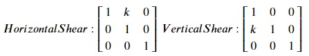

## Shear
We can stretch and skew the image using a shear transformation matrix horizontally or vertically. Following are the shear transformation matrices:

Here, k is the shear factor. Let's try horizontal shear transformation by a factor of 1. Copy the following code to the editor:

<pre class="file" data-filename="la.py" data-target="replace">
# Importing libraries
import numpy as np
import matplotlib.pyplot as plt
from PIL import Image

# Loading image
img = Image.open("./images/img1.jpg") 
img.load()

# Image as a matrix
img_data = np.asarray(img, dtype="int32")

# Transformation matrix for horizontal shear with k=1
T = np.array([[1, 1, 0],
              [0, 1, 0],
              [0, 0, 1]])

# Empty array is used for storing transformed data
# First element of array's shape is twice the original size
# to accomodate the transformed image
img_transformed = np.empty((img_data.shape[0]*2, img_data.shape[1], img_data.shape[2]), dtype=np.uint8)

# Iterating over the whole image matrix to transform each element
for i, row in enumerate(img_data):
    for j, col in enumerate(row):
        # Getting original data
        pixel_data = img_data[i, j, :]
        input_coords = np.array([i, j, 1])
        # Performing linear transformation using matrix multiplication
        i_out, j_out, _ = T @ input_coords
        # Storing transformed data
        img_transformed[i_out, j_out, :] = pixel_data

plt.figure(figsize=(5, 5))
plt.imshow(img_transformed)
plt.savefig("image6.jpg") # Saving image as a file
</pre>

Run `la.py` using the following command:

`python3 la.py`{{execute}} (This code doesn't produce any output in the terminal.)

Click and open the newly formed `image6.jpg`{{open}} in the VScode sidebar to view the newly formed image.

Let's try vertical shear transformation by a factor of 1. Copy the following code to the editor:

<pre class="file" data-filename="la.py" data-target="replace">
# Importing libraries
import numpy as np
import matplotlib.pyplot as plt
from PIL import Image

# Loading image
img = Image.open("./images/img1.jpg") 
img.load()

# Image as a matrix
img_data = np.asarray(img, dtype="int32")

# Transformation matrix for vertical shear with k=1
T = np.array([[1, 0, 0],
              [1, 1, 0],
              [0, 0, 1]])

# Empty array is used for storing transformed data
# Second element of array's shape is thrice the original size
# to accomodate the transformed image
img_transformed = np.empty((img_data.shape[0], img_data.shape[1]*3, img_data.shape[2]), dtype=np.uint8)

# Iterating over the whole image matrix to transform each element
for i, row in enumerate(img_data):
    for j, col in enumerate(row):
        # Getting original data
        pixel_data = img_data[i, j, :]
        input_coords = np.array([i, j, 1])
        # Performing linear transformation using matrix multiplication
        i_out, j_out, _ = T @ input_coords
        # Storing transformed data
        img_transformed[i_out, j_out, :] = pixel_data

plt.figure(figsize=(5, 5))
plt.imshow(img_transformed)
plt.savefig("image7.jpg") # Saving image as a file
</pre>

Run `la.py` using the following command:

`python3 la.py`{{execute}} (This code doesn't produce any output in the terminal.)

Click and open the newly formed `image7.jpg`{{open}} in the VScode sidebar to view the newly formed image.