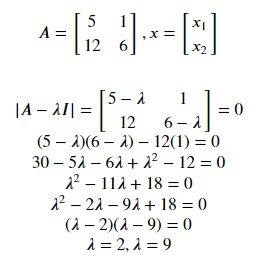
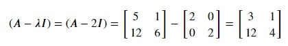
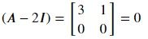
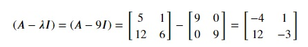
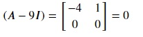

## Eigendecomposition
This is the process of factorization of a matrix into a canonical form, whereby the matrix is represented in the form of its eigenvectors and eigenvalues. Let's see the mathematical process used in finding eigenvalues and eigenvectors of a given matrix.

x is an eigenvector for a matrix A if

**Ax = 𝜆x**
 
where 𝜆 is a scalar quantity.

Clearly,

**Ax − 𝜆x = 0**
 
We can add an identity matrix to 𝜆 as it doesn't change the equation. Now, we have

**(A - 𝜆I)x = 0**
 
As we want non-trivial solutions to this equation, x can't be a zero vector. This also means that (A - 𝜆I) is not invertible. If it were invertible, then x would have to be a zero vector and we have already stated that zero vector can't be an eigenvector.

As (A - 𝜆I) is not invertible, it's determinant is zero.

**|A - 𝜆I| = 0**

This is the characteristic equation and its solutions will be the eigenvalues of matrix A. For example,

Therefore, the eigenvalues of matrix A are 2 and 9. Now, let's find the eigenvectors. For this, we will solve the equation (A - 𝜆I) for both eigenvalues.

For 𝜆 = 2,

Reducing this equation using elementary row transformation R2  →  R2 - 4R1,

This means,

**3x1 + x2 = 0**

Therefore,

**x2 = -3x1**

Therefore, for 𝜆 = 2, eigenvectors are of the form x = (x1,-3x1) and its scalar multiples. (1,-3), (-1,3) and (-3,9) are some examples of these eigenvectors.

For 𝜆 = 9,

Reducing this equation using elementary row transformation R2  →  R2 + 3R1,

This means,

**-4x1 + x2 = 0**

Therefore,

**x2 = 4x1**

Therefore, for 𝜆 = 9, eigenvectors are of the form x = (x1,4x1) and its scalar multiples. (1,4), (2,8) and (3,12) are some examples of these eigenvectors.

Now, let's check this implementation's numpy equivalent for matrix A. Copy the following code to the editor:

<pre class="file" data-filename="vector.py" data-target="replace">
# Importing numpy
import numpy as np

m = np.matrix([[5,1],[12,6]]) # Transformation matrix for 90 degree counter-clockwise rotation

# Get eigenvalues and eigenvectors using np.linalg.eig() method
e_values, e_vectors = np.linalg.eig(m)

# Print eigenvalues and eigenvectors
print("Eigenvalues:",e_values)
print("Eigenvectors:")
print(e_vectors)
</pre>

Run `vector.py` using the following command:

`python3 vector.py`{{execute}}

Numpy outputs same eigenvalues as the above implementation but the eigenvectors can be difficult to understand. Instead of providing an algebraic form in the above implementation, numpy outputs a matrix of two concatenated 2 × 1 unit vectors corresponding to their eigenvalues.

We can see the second element of the first vertical vector is negative three times the first element which is the algebraic expression for 𝜆 = 2 in the above implementation i.e., x2 = -3x1

Similarly, the second element of the second vertical vector is four times the first element which is the algebraic expression for 𝜆 = 9 in the above implementation i.e., x2 = 4x1

Hence, we have verified our implementation.

