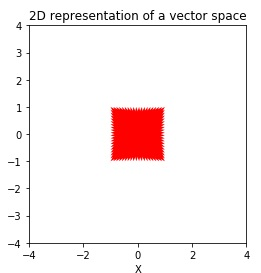

## Rotation
We can rotate all vectors in a vector space through an angle  𝜃  either clockwise or counter-clockwise. Let's create a customizable linear transformation function for rotation and then plot the results. Let's create a customizable linear transformation function for scaling and then plot the results.

#### A customizable linear transformation for rotation
<pre>
def rotation(v,clockwise=False,degree=90):
    # Degree to radian
    radian = np.radians(degree)
    if clockwise==False:
        m = np.matrix([[np.cos(radian),-np.sin(radian)],
                  [np.sin(radian),np.cos(radian)]])
    else:
        m = np.matrix([[np.cos(radian),np.sin(radian)],
                  [-np.sin(radian),np.cos(radian)]])
    return m @ v
</pre>

Following is the vector space we plotted in Step 1. Let's see how applying the scaling transformation changes this vector space. 

Copy the following code to the editor:

<pre class="file" data-filename="vector.py" data-target="replace">
# Importing numpy and matplotlib
import numpy as np
import matplotlib.pyplot as plt

# Create rotation function
def rotation(v,clockwise=False,degree=90):
    radian = np.radians(degree)
    if clockwise==False:
        m = np.matrix([[np.cos(radian),-np.sin(radian)],
                  [np.sin(radian),np.cos(radian)]])
    else:
        m = np.matrix([[np.cos(radian),np.sin(radian)],
                  [-np.sin(radian),np.cos(radian)]])
    return m @ v

# Define origin or location
# This is defined tuple of lists
origin = [0],[0]

# Two arrays of 20 equally spaced elements
x = np.linspace(-1,1,num=20)
y = np.linspace(-1,1,num=20)

# This nested loop creates 400 vectors in the vector space
for i in x:
    for j in y:
       # Create vector 
        vector_v = np.matrix([[float(i)],
                              [float(j)]])
        # Rotate it
        rotated_v = rotation(vector_v,clockwise=True,degree=100)
        # Transform vector for plotting
        v = [float(rotated_v[0])],[float(rotated_v[1])]
        # plt.quiver plots vector
        plt.quiver(*origin, *v, color='r', units='xy', angles='xy', scale_units='xy', scale=1)
plt.xlim(-4, 4)
plt.ylim(-4, 4)
plt.xlabel('X')
plt.ylabel('Y')
# Setting aspect ratio for the plot
plt.gca().set_aspect('equal', adjustable='box')
plt.title("100 degree clockwise rotation")
# Saving image as a PNG file
plt.savefig('rvs.png')
plt.show()
</pre>

Run `vector.py` using the following command:

`python3 vector.py`{{execute}} (This code doesn't produce any output on the terminal.)

Click and view the newly formed `rvs.png`{{open}} file from the VScode sidebar.

The resulting vector space is tilted towards right.