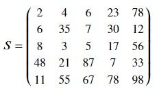

## Slicing and indexing
A part of a matrix can be obtained by slicing and indexing numpy matrices. This is useful for selecting and accessing data across the data science pipeline. Here are some examples. Given a 5 × 5 matrix,

We will use matrix S to demonstrate various examples of slicing and indexing in numpy. Indexing involves using the index of an element to retrieve it. Slicing involves selecting elements over a range of indices. In numpy, indexing and slicing are performed just like Python's inbuilt container objects like lists. Colon is used for slicing in numpy. Let's see some examples of slicing and indexing.

### Getting middle element in the center

<pre class="file" data-filename="matrix.py" data-target="replace">
import numpy as np
# Create matrix S using numpy
S = np.matrix([[2,4,6,23,78],
              [6,35,7,30,12],
              [8,3,5,17,56],
              [48,21,87,7,33],
              [11,55,67,78,98]])
# Getting middle element in the center
print(S[2,2])
</pre>

Run `matrix.py` using the following command:

`python3 matrix.py`{{execute}}

As the index starts from 0, row 2 for 3rd row and column 2 for 3rd column in matrix S have been chosen.

### Getting second row from top

<pre class="file" data-filename="matrix.py" data-target="replace">
import numpy as np
S = np.matrix([[2,4,6,23,78],
              [6,35,7,30,12],
              [8,3,5,17,56],
              [48,21,87,7,33],
              [11,55,67,78,98]])
# Getting second row from top
print(S[1,:])
</pre>

Run `matrix.py` using the following command:

`python3 matrix.py`{{execute}}

Row 1 has been selected for second row, followed by colon to select all column values in that row from column 0 to column 4.

### Getting fourth column from the left

<pre class="file" data-filename="matrix.py" data-target="replace">
import numpy as np
S = np.matrix([[2,4,6,23,78],
              [6,35,7,30,12],
              [8,3,5,17,56],
              [48,21,87,7,33],
              [11,55,67,78,98]])
# Getting fourth column from the left
print(S[:,3])
</pre>

Run `matrix.py` using the following command:

`python3 matrix.py`{{execute}}

Column 3 has been selected for fourth column, preceded by colon to select all row values in that column from row 0 to row 4.

### Getting the last column

<pre class="file" data-filename="matrix.py" data-target="replace">
import numpy as np
S = np.matrix([[2,4,6,23,78],
              [6,35,7,30,12],
              [8,3,5,17,56],
              [48,21,87,7,33],
              [11,55,67,78,98]])
# Getting the last column
print(S[:,-1])
</pre>

Run `matrix.py` using the following command:

`python3 matrix.py`{{execute}}

-1 has been used to used to select last column using negative indexing like python lists.

### Getting first three columns

<pre class="file" data-filename="matrix.py" data-target="replace">
import numpy as np
S = np.matrix([[2,4,6,23,78],
              [6,35,7,30,12],
              [8,3,5,17,56],
              [48,21,87,7,33],
              [11,55,67,78,98]])
# Getting first three columns
print(S[:,:3])
</pre>

Run `matrix.py` using the following command:

`python3 matrix.py`{{execute}}

Colon to select all rows, followed by `:3` which means selecting till before column 3 from the start i.e., selecting columns 0, 1 and 2.

### Getting second, third and fourth rows

<pre class="file" data-filename="matrix.py" data-target="replace">
import numpy as np
S = np.matrix([[2,4,6,23,78],
              [6,35,7,30,12],
              [8,3,5,17,56],
              [48,21,87,7,33],
              [11,55,67,78,98]])
# Getting second, third and fourth rows
print(S[1:4,:])
</pre>

Run `matrix.py` using the following command:

`python3 matrix.py`{{execute}}

Here,  `1:4` means starting from row 1 till before row 4.

### Getting last three rows

<pre class="file" data-filename="matrix.py" data-target="replace">
import numpy as np
S = np.matrix([[2,4,6,23,78],
              [6,35,7,30,12],
              [8,3,5,17,56],
              [48,21,87,7,33],
              [11,55,67,78,98]])
# Getting last three rows
print(S[-3:,:])
</pre>

Run `matrix.py` using the following command:

`python3 matrix.py`{{execute}}

Here, `-3:` means selecting from the third last dimension i.e, third last row in this case.

### Getting first three rows and last two columns

<pre class="file" data-filename="matrix.py" data-target="replace">
import numpy as np
S = np.matrix([[2,4,6,23,78],
              [6,35,7,30,12],
              [8,3,5,17,56],
              [48,21,87,7,33],
              [11,55,67,78,98]])
# Getting first three rows and last two columns
print(S[:3,-2:])
</pre>

Run `matrix.py` using the following command:

`python3 matrix.py`{{execute}}

### Getting every other column

<pre class="file" data-filename="matrix.py" data-target="replace">
import numpy as np
S = np.matrix([[2,4,6,23,78],
              [6,35,7,30,12],
              [8,3,5,17,56],
              [48,21,87,7,33],
              [11,55,67,78,98]])
# Getting every other column
print(S[:,::2])
</pre>

Run `matrix.py` using the following command:

`python3 matrix.py`{{execute}}

Here, `::2` means every second column starting from the left.

### Getting second, third and fifth column(column 1, 2 and 4)

<pre class="file" data-filename="matrix.py" data-target="replace">
import numpy as np
S = np.matrix([[2,4,6,23,78],
              [6,35,7,30,12],
              [8,3,5,17,56],
              [48,21,87,7,33],
              [11,55,67,78,98]])
# Getting second, third and fifth column(column 1, 2 and 4)
print(S[:,[1,2,4]])
</pre>

Run `matrix.py` using the following command:

`python3 matrix.py`{{execute}}

As shown in the code above, for selecting non-continuous index numbers, we can pass a list of index numbers.