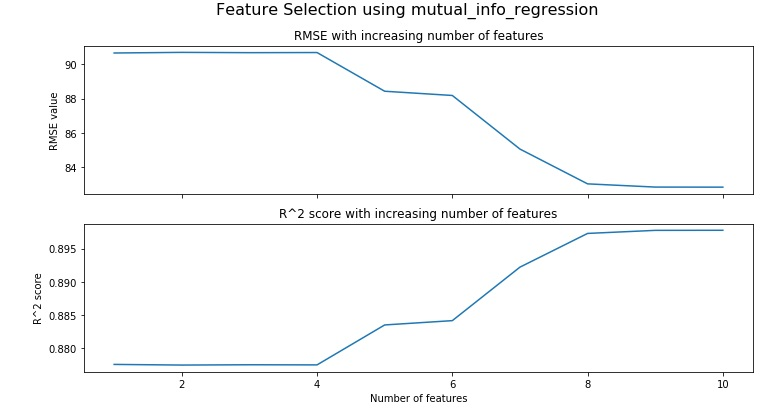

#### Mutual Information Method
In this method, we estimate the mutual information for a continuous target variable. Mutual information between two random variables is a value that measures the dependency between them. If two random variables are independent, this value is zero and higher values mean higher dependency.

We will use `mutual_info_regression()` method to apply mutual information method. Append the following code to the editor:

<pre class="file" data-filename="lr.py" data-target="replace">
# Importing numpy and pandas
import numpy as np
import pandas as pd
from sklearn.linear_model import LinearRegression
# Reading the csv file using pandas 
data = pd.read_csv("data/data.csv")

# Extracting dependent and independent variables
X = data.drop(["Target"],axis=1)
y = data["Target"]

# Importing splitting method from Scikit-learn
from sklearn.model_selection import train_test_split
# Splitting
X_train, X_test, y_train, y_test = train_test_split(X, y,
                                                    test_size=0.3,
                                                    random_state=100,
                                                    shuffle=True)

from sklearn.feature_selection import mutual_info_regression

# Feature selection using SelectKBest
# Fit a model using training data using mutual_info_regression method 
skb = SelectKBest(mutual_info_regression).fit(X, y)

# DataFrame of variables w/ corresponding scores
skb_df = pd.DataFrame({"Feature/Column": list(X.columns),"Scores":skb.scores_})

# Plot a bar plot for scores
skb_df.sort_values("Scores",ascending=False).set_index("Feature/Column").plot(kind="bar")
plt.title("Mutual Information based Feature Selection scores")
# Saving plot as a PNG file
plt.savefig("Plot2.png")
plt.show()
</pre>

Run `lr.py` using the following command:

`python3 lr.py`{{execute}} (This code doesn't produce any output on the terminal.)

Click and view the newly formed `Plot2.png`{{open}} file from the VScode sidebar.

Here, we should include all features but `Feat01` in our model. The order of importance is also different from F-value method. Let's estimate the model performance using cross-validation. Append the following code to the editor:

<pre class="file" data-filename="lr.py" data-target="append">
print("3-Fold cross-validation with 9 features")

# 3-Fold cross-validation scored using R^2 score
r2_cross_val = cross_val_score(LinearRegression(),X.drop(["Feat01"],axis=1),y,cv=3,scoring="r2")
print("The 3-fold CV R^2 scores are {} \nwith a mean R^2 score of {:.4f}".format(r2_cross_val,np.mean(r2_cross_val)))

# 3-Fold cross-validation scored using RMSE
rmse_cross_val = cross_val_score(LinearRegression(),X.drop(["Feat01"],axis=1),y,cv=3,scoring="neg_root_mean_squared_error")
print("The 3-fold CV RMSE scores are {} \nwith a mean RMSE of {:.4f}".format([-i for i in rmse_cross_val],-np.mean(rmse_cross_val)))
</pre>

Run `lr.py` using the following command:

`python3 lr.py`{{execute}}

RMSE has actually improved slightly here and R-squared score remains same. So, we only have to remove `Feat01`. We can check the effect on performance with each new feature addition. Following plot shows the effect on performance of the model with each new feature addition:

Looking at the trend, it is advised to include 8 (or even 9) features in the final model as there is not much improvement in performance with the addition of the last two features.