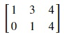
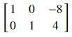

## Reduced row echelon form
This is a stricter subset of row echelon where matrices must satisfy an extra condition other than the three conditions required for row echelon form.
* The leading 1 in a column should be the only non-zero element of that column.

 The following matrix satisfies all 3 conditions of row echelon form. But this matrix is not in its reduced row echelon form. In the second column, leading 1 of the last row is not the only non-zero element.

Following is the reduced row echelon form of the above matrix. This was achieved by subtracting three times the second row from the first row.

