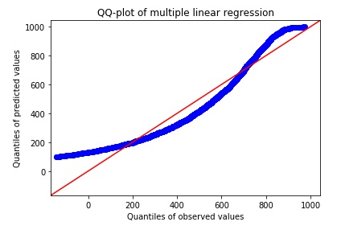

### Model Evaluation 

**QQ-plot** is formed when quantiles of two variables are plotted against each other. Ideally, all points should lie on or close to the straight line at an angle of 45°. Following is the QQ-plot for the original model without polynomial features:

Clearly, only a few points lie close to the 45° line. For half the quantiles, x quantiles are lower than y quantiles and vice-versa.

Let's plot a QQ-plot for our polynomial regression model. Statsmodels provides the `qqplot_2samples()` method to form the QQ-plot. Append the following code to the editor:

<pre class="file" data-filename="lr.py" data-target="append">
from sklearn.model_selection import train_test_split
from statsmodels.graphics.gofplots import qqplot_2samples

# Splitting the new top 25 features of 2nd degree polynomial data
X_train_poly, X_test_poly, y_train, y_test = train_test_split(X_poly2_25, y,
                                                    test_size=0.3,
                                                    random_state=100,
                                                    shuffle=True)
# Training a linear model
poly_model = LinearRegression()
poly_model.fit(X_train_poly,y_train)
poly_pred = poly_model.predict(X_test_poly) # Taking predictions

## Normal QQ-plot
qqplot_2samples(y_test,poly_pred,line='45')
plt.title("QQ-plot of polynomial regression")
plt.xlabel("Quantiles of observed values")
plt.ylabel("Quantiles of predicted values")

# Saving plot as a PNG file
plt.savefig("Plot2.png")
plt.show()
</pre>

Run `lr.py` using the following command:

`python3 lr.py`{{execute}} (This code doesn't produce any new output on the terminal.)

Click and view the newly formed `Plot2.png`{{open}} file from the VScode sidebar.

The QQ-plot for polynomial regression is near perfect while the QQ-plot for multiple linear regression has very few points lying on the 45° line.