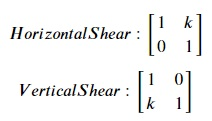

## Shear
We can skew the vector space in a horizontal or vertical direction using shear based matrix transformations. For the shear element k,

#### A customizable linear transformation for shear
<pre>
def shear(v,horizontal=True,k=1):
    if horizontal==True:
        m = np.matrix([[1,k],
                       [0,1]])
    else:
        m = np.matrix([[1,0],
                       [k,1]])
    return m @ v
</pre>

Following is the vector space we plotted in Step 1. Let's see how applying the scaling transformation changes this vector space. 

Copy the following code to the editor:

<pre class="file" data-filename="vector.py" data-target="replace">
# Importing numpy and matplotlib
import numpy as np
import matplotlib.pyplot as plt

# Create shear function
def shear(v,horizontal=True,k=1):
    if horizontal==True:
        m = np.matrix([[1,k],
                       [0,1]])
    else:
        m = np.matrix([[1,0],
                       [k,1]])
    return m @ v

# Define origin or location
# This is defined tuple of lists
origin = [0],[0]

# Two arrays of 20 equally spaced elements
x = np.linspace(-1,1,num=20)
y = np.linspace(-1,1,num=20)

# This nested loop creates 400 vectors in the vector space
for i in x:
    for j in y:
       # Create vector 
        vector_v = np.matrix([[float(i)],
                              [float(j)]])
        # Skew it
        shear_v = shear(vector_v,horizontal=True,k=2/4)
        # Transform vector for plotting
        v = [float(shear_v[0])],[float(shear_v[1])]
        # plt.quiver plots vector
        plt.quiver(*origin, *v, color='r', units='xy', angles='xy', scale_units='xy', scale=1)
plt.xlim(-4, 4)
plt.ylim(-4, 4)
plt.xlabel('X')
plt.ylabel('Y')
# Setting aspect ratio for the plot
plt.gca().set_aspect('equal', adjustable='box')
plt.title("Horizontal Shear: k = 2/4")
# Saving image as a PNG file
plt.savefig('hsvs.png')
plt.show()
</pre>

Run `vector.py` using the following command:

`python3 vector.py`{{execute}} (This code doesn't produce any output on the terminal.)

Click and view the newly formed `hsvs.png`{{open}} file from the VScode sidebar.

The resulting vector space is stretched horizontally.