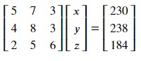

## Gaussian Elimination
Gaussian elimination is a method for solving linear equations using matrices and matrix operations.

In this process, elementary operations are performed to convert the augmented matrix of our set of linear equations to reduce it to a row echelon form(can be more than one) or its reduced row echelon form(unique) and then calculate the values of the variables. It is much like the Gauss-Jordan method used in the previous notebook to calculate the inverse matrix as the identity matrix satisfies all the conditions of reduced row echelon form.

There are three kinds of elementary operations:
* Swapping two rows
* Adding(or subtracting) a multiple of one row to the other
* Multiple one row with a non-zero scalar

Let's solve a system of linear equations using gaussian elimination.

Every year John, a teacher buys medals for the best students of his class. The first year he bought 5 gold medals, 7 silver medals and 3 bronze medals for 230 euros. The next year he bought 4 gold medals, 8 silver medals and 3 bronze medals for 238 euros. The third year he bought 2 gold medals, 5 silver medals and 6 bronze medals for 184 euros. Assuming the price of the medals has remained same all three years, what is the price of a gold, silver and bronze medal individually?

Let x, y and z be the prices of gold, silver and bronze medals respectively. Following are the three equations formed:

**5𝑥+7𝑦+3𝑧=230**
**4𝑥+8𝑦+3𝑧=238**
**2𝑥+5𝑦+6𝑧=184**

Remembering the working of matrix multiplication, we can write these equations in the form of matrices.

This is of the form Ax=B. Let's use gauss elimination method in python to solve this set of equations.

**Step 1:** Create an augmented matrix (A|b) by concatenating b to matrix A.

To perform this, copy the following code to the editor: 

<pre class="file" data-filename="equation.py" data-target="replace">
# Importing numpy
import numpy as np
# Create matrices A and B
A = np.matrix([[5.0,7.0,3.0],
              [4.0,8.0,3.0],
              [2.0,5.0,6.0]])
b = np.matrix([[230.0],
               [238.0],
               [184.0]])
# Concatenate A and b
Ab = np.concatenate((A,b),axis=1)
# Printing the augmented matrix
print("Augemented matrix after Step 1:")
print(Ab)
</pre>

Run `equation.py` using the following command to get results of step 1:

`python3 equation.py`{{execute}}

We have to convert matrix A in augmented matrix (A|b) to its row echelon form or reduced row echelon form.

**Step 2:** Transform column 0 of A|b to column 0 of its equivalent identity matrix. Multiply row 0 by 1/5. Then, subtract 4 times row 0 from row 1 and 2 times row 0 from row 2.

Append the following code to the editor: 

<pre class="file" data-filename="equation.py" data-target="append">
# row0 = 1/5 * row0
Ab[0,:] = (1/Ab[0,0]) * Ab[0,:]
# row1 = row1 - 4*row0
Ab[1,:] = Ab[1,:] - Ab[1,0]*Ab[0,:]
# row2 = row2 - 2*row0
Ab[2,:] = Ab[2,:] - Ab[2,0]*Ab[0,:]

# Printing the results
print("Augemented matrix after Step 2:")
print(Ab)
</pre>

Run `equation.py` using the following command to get results of step 2:

`python3 equation.py`{{execute}}

**Step 3:** Transform column 1 of A|b to column 1 of its equivalent identity matrix. Divie row 1 by 2.4. Then, subtract 2.2 times row 1 from row 2 and 1.4 tiems row 1 from row 2.

Append the following code to the editor

<pre class="file" data-filename="equation.py" data-target="append">
# row1 = 1/2.4 * row1
Ab[1,:] = (1/Ab[1,1]) * Ab[1,:]
# row2 = row2 - 2.2*row1
Ab[2,:] = Ab[2,:] - Ab[2,1]*Ab[1,:]
# row0 = row0 - 1.4*row1
Ab[0,:] = Ab[0,:] - Ab[0,1]*Ab[1,:]

# Printing the results
print("Augemented matrix after Step 3:")
print(Ab)
</pre>

Run `equation.py` using the following command to get results of step 3:

`python3 equation.py`{{execute}}

**Step 4:** Transform column 2 of A|b to column 2 of its equivalent identity matrix. Divide row 2 by 4.25(multiply by 100/425). When solving on paper, we can stop here and solve the equations as we have the value of one of the variables, z. Here, we must fully reduce the matrix into an identity matrix for the desired result. So, subtract 0.25 times row 2 from row 0 and row 1 to obtain the identity matrix. An identity matrix satisfies all four conditions of reduced row echelon form.

Append the following code to the editor: 

<pre class="file" data-filename="equation.py" data-target="append">
# row2 = 1/4.25 * row2
Ab[2,:] = (1/Ab[2,2]) * Ab[2,:]
# row0 = row0 - 0.25*row2
Ab[0,:] = Ab[0,:] - Ab[0,2]*Ab[2,:]
# row1 = row1 - 0.25*row2
Ab[1,:] = Ab[1,:] - Ab[1,2]*Ab[2,:]

# Printing the results
print("Augemented matrix after Step 4:")
print(Ab)
</pre>

Run `equation.py` using the following command to get results of step 4:

`python3 equation.py`{{execute}}

**Step 5:** Finally, extract matrix b from A|b. Matrix b now represents x, y, z by its elements.

Append the following code to the editor: 

<pre class="file" data-filename="equation.py" data-target="append">
ans = Ab[:,-1]

# Printing the results
print("Values of x, y and z respectively:")
print(ans)
</pre>

Run `equation.py` using the following command to get results of step 5:

`python3 equation.py`{{execute}}

Therefore, x=12, y=20 and z=10. A gold medal costs 12 euros, a silver medal costs 20 euros and a bronze medal costs 10 euros.

Alternatively, numpy provides `np.linalg.solve()` method to solve a system of linear equations. Let's see an example of this method. Copy the following code to the editor:

<pre class="file" data-filename="equation.py" data-target="replace">
# Importing numpy
import numpy as np
# Create matrices A and B
A = np.matrix([[5.0,7.0,3.0],
              [4.0,8.0,3.0],
              [2.0,5.0,6.0]])
b = np.matrix([[230.0],
               [238.0],
               [184.0]])

# Solve the system of linear equations
ans = np.linalg.solve(A,b)

# Printing the results
print("Values of x, y and z respectively:")
print(ans)
</pre>

Run `equation.py` using the following command:

`python3 equation.py`{{execute}}

