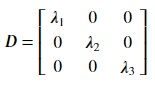
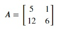

## Matrix Diagonalization
Matrix diagonalization is a useful application of eigenvalues and eigenvectors. It involves transformation of a square matrix into a diagonal matrix that shares the same properties as the original matrix. For a matrix A, this relation can be written as

**A = CDC-1**
 
where C is a matrix composed of the eigenvectors of matrix A and D is the diagonal matrix containing corresponding eigenvalues of matrix C.

Given A is a 3 × 3 matrix having eigenvalues 𝜆1, 𝜆2, 𝜆3. Then, the diagonal matrix D will be

Let's demonstrate diagonalization in numpy using the following matrix:

Copy the following code to the editor:

<pre class="file" data-filename="vector.py" data-target="replace">
# Importing numpy
import numpy as np

# Create matrix A
A = np.matrix([[5,1],[12,6]])

# Get eigenvalues and eigenvectors using np.linalg.eig() method
e_values, e_vectors = np.linalg.eig(A)

# Print eigenvalues and eigenvectors
print("Eigenvalues:",e_values)
print("Eigenvectors:")
print(e_vectors)

# Create a diagonal matrix from the eigenvalues
# np.diag() creates diagonal matrix using an array to map diagonal values
D = np.diag(e_values)
print("Diagonal matrix D:")
print(D)

# C is the above eigenvector matrix
C = e_vectors
print("Matrix C:")
print(C)

# Get the inverse of C 
C_inv = np.linalg.inv(C)
print("Inverse of matrix C:")
print(C_inv)

# Matrix multiplication of C, D, and C_inv to get matrix A
a = C @ D @ C_inv
print("Matrix formed after applying diagonalization formula:")
print(a)

# Verify if original matrix A = C @ D @ C_inv
print("Verified?")
print(np.allclose(A,a))
</pre>

Run `vector.py` using the following command:

`python3 vector.py`{{execute}}

Matrix diagonalization can be used to efficiently compute the powers of a matrix. For this, we only have to compute the powers of the diagonal matrix D such that

**Ak = CDkC-1**