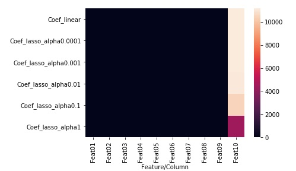

### Evaluating lasso regression
Let's print out the table of coefficients. Append the following code to the editor:

<pre class="file" data-filename="lr.py" data-target="append">
lasso_alpha_comparison = model_coefs.set_index("Feature/Column").apply(lambda x: np.abs(x),axis=1)
print(lasso_alpha_comparison)
</pre>

Run `lr.py` using the following command:

`python3 lr.py`{{execute}}

Following is a heatmap summarising this table:

In order to reduce the coefficient of strong regressor `Feat10`, the coefficients of other regressors have actually increased. We can choose the penalty where 𝜆 = 0.1. At 𝜆 = 0.01, the coefficient of `Feat07` becomes 0 indicating a weak regressor. At 𝜆 = 1.0, the coefficient of Feat01 being 0 also indicates a weak regressor.

Let's cross-validate our model at 𝜆 = 0.1. Append the following code to the editor:

<pre class="file" data-filename="lr.py" data-target="append">
from sklearn.model_selection import cross_val_score

r2_cross_val = cross_val_score(Lasso(alpha=0.1),X,y,cv=3,scoring="r2")
print("At alpha = 0.1 , the 3-fold CV R^2 scores are {} \nwith a mean R^2 score of {:.4f}".format(r2_cross_val,np.mean(r2_cross_val)))
rmse_cross_val = cross_val_score(Lasso(alpha=0.1),X,y,cv=3,scoring="neg_root_mean_squared_error")
print("At alpha = 0.1 , the 3-fold CV RMSE scores are {} \nwith a mean RMSE of {:.4f}".format([-i for i in rmse_cross_val],-np.mean(rmse_cross_val)))
</pre>

Run `lr.py` using the following command:

`python3 lr.py`{{execute}}

At 𝜆 = 0.1, we have sacrificed negligible performance but the model is less likely to overfit.