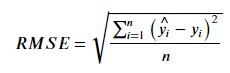

### Model Evaluation
We will be evaluating the model now. We will start by using the metrics R-squared score and RMSE.

**R-squared score** - This score varies from 0 to 1 and represents the proportion of variance of the dependent variable explained by the independent variable(s). It conveys the extent to which the variance of one variable explains the variance of the other. The ideal score is 1.0 which conveys that 100% of the variance of the dependent variable is explained by the independent variables.

**Root Mean Squared Error(RMSE)** - RMSE is the standard deviation of the residuals (prediction errors). It measures the spread of the data around the line of best fit. RMSE is always non-negative with a value of 0 being ideal. A lower RMSE is better than a higher one. RMSE of two different datasets should not be compared as this measure is dependent on the scales of the data.

Here, 𝑦̂ is the predicted value and y is the observed value. n is the number of rows in the dataset.

Let's calculate these metrics. Copy the following code to the editor:

<pre class="file" data-filename="lr.py" data-target="replace">
# Importing pandas
import pandas as pd
# Reading the csv file using pandas 
data = pd.read_csv("data/data.csv")

# Extracting dependent and independent variables
X = data.drop(["Target"],axis=1)
y = data["Target"]

# Importing splitting method from Scikit-learn
from sklearn.model_selection import train_test_split
# Splitting
X_train, X_test, y_train, y_test = train_test_split(X, y,
                                                    test_size=0.3,
                                                    random_state=100,
                                                    shuffle=True)

# Fitting a linear model
from sklearn.linear_model import LinearRegression
model = LinearRegression()
# Training our model
model.fit(X_train,y_train)

# Taking predictions for the test set
y_pred = model.predict(X_test)

# Importing metrics from Scikit-learn
from sklearn.metrics import r2_score, mean_squared_error
# Calculating metrics
print("The R-squared score is {:.4f}".format(r2_score(y_test,y_pred)))
print("The Root Mean Squared error is {:.4f}".format(np.sqrt(mean_squared_error(y_test,y_pred))))
</pre>

Run `lr.py` using the following command:

`python3 lr.py`{{execute}}

The model used above explains only 89.78% variance of the dependent variable. This can be improved using more data and better features. Without comparing with other models, we can't infer much using the RMSE value as it is relative to the independent and dependent variables of the simulated dataset.

**Residuals** are prediction errors i.e., difference between the observed value and the predicted value.

Residuals are used in various performance metrics and can be used to visualize model performance. A resdiuals plot shows residuals on the vertical axis and predicted values on the horizontal axis. In a ideal residuals plot, the distribution of residuals around the target is random and uniformly centered around zero. A good model leads to constant variability in the residuals plot.

Let's plot a residual plot. Copy the following code to the editor:

<pre class="file" data-filename="lr.py" data-target="replace">
# Importing numpy, pandas and matplotlib
import numpy as np
import pandas as pd
import matplotlib.pyplot as plt
# Reading the csv file using pandas 
data = pd.read_csv("data/data.csv")

# Extracting dependent and independent variables
X = data.drop(["Target"],axis=1)
y = data["Target"]

# Importing splitting method from Scikit-learn
from sklearn.model_selection import train_test_split
# Splitting
X_train, X_test, y_train, y_test = train_test_split(X, y,
                                                    test_size=0.3,
                                                    random_state=100,
                                                    shuffle=True)

# Fitting a linear model
from sklearn.linear_model import LinearRegression
model = LinearRegression()
# Training our model
model.fit(X_train,y_train)

# Taking predictions for the test set
y_pred = model.predict(X_test)

# Residuals plot(overall)
plt.figure(figsize=(15,4))
plt.scatter(y_pred,y_test-y_pred)
plt.title("Residuals plot")
plt.xlabel("Predicted value")
plt.ylabel("Residuals")
plt.savefig("res1.png") # Saving the plot as a PNG file
plt.show()
</pre>

Run `lr.py` using the following command:

`python3 lr.py`{{execute}} (This code doesn't produce any output on the terminal.)

Click and view the newly formed `res1.png`{{open}} file from the VScode sidebar.

The residuals plot formed by the above code is not randomly or uniformly distributed. In fact, there are some predictions with negative values which is not possible as the dependent variable (bike count) can't be negative. 

Let's plot a histogram of residuals. Append the following to the editor:

<pre class="file" data-filename="lr.py" data-target="append">
plt.figure(figsize=(10,4))
plt.hist(y_test-y_pred, bins= 20)
plt.title("Histogram of residuals")
plt.savefig("res2.png")
plt.show()
</pre>

Run `lr.py` using the following command:

`python3 lr.py`{{execute}} (This code doesn't produce any output on the terminal.)

Click and view the newly formed `res2.png`{{open}} file from the VScode sidebar.

The histogram formed by the above code also depicts that the error is not normally distributed around zero and right-skewed. We need a better model as this is not a good fit.

A **QQ-plot** is formed when quantiles of two variables are plotted against each other. Ideally, all points should lie on or close to the straight line at an angle of 45°.

Let's plot a QQ-plot for our model. Statsmodels provides the `qqplot_2samples()` method to form the QQ-plot. Append the following code to the editor:

<pre class="file" data-filename="lr.py" data-target="append">
## Normal QQ-plot
from statsmodels.graphics.gofplots import qqplot_2samples
qqplot_2samples(y_test,y_pred,line='45')
plt.title("QQ-plot")
plt.xlabel("Quantiles of observed values")
plt.ylabel("Quantiles of predicted values")
plt.savefig("qq.png")
plt.show()
</pre>

Run `lr.py` using the following command:

`python3 lr.py`{{execute}} (This code doesn't produce any output on the terminal.)

Click and view the newly formed `qq.png`{{open}} file from the VScode sidebar.

Clearly, only a few points lie close to the 45° line. For half the quantiles, x quantiles are lower than y quantiles and vice-versa. A model with a better fit is needed.