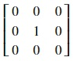
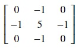

## Convolution based transformations
In image processing, convolution operation is applied between a kernel and the image. The kernel matrix is very small compared to the image matrix and when convolved with the image matrix can be used for tasks like edge detection, blurring, sharpening, etc. Convolution operation involves adding each element of the image matrix to its neighbors. 

According to [Wikipedia](https://en.wikipedia.org/wiki/Convolution), in mathematics, convolution is a mathematical operation on two functions (kernel and image in our case) that produces a third function that expresses how the shape of one is modified by the other. The term convolution refers to both the result function and to the process of computing it. It is defined as the integral of the product of the two functions after one is reversed and shifted. And the integral is evaluated for all values of shift, producing the convolution function.

We will use the `convolve()` method provided by `scipy` to perform calculations. Let's try some convolution based transformations.

### Identity kernel
We can get the exactly same image as the input image by using the following kernel:

Let's verify it using code. We will convert our image to its grayscale counterpart to apply this kernel for simplicity. Copy the following code to the editor:

<pre class="file" data-filename="la.py" data-target="replace">
# Importing libraries
import numpy as np
import matplotlib.pyplot as plt
from PIL import Image, ImageOps
from scipy.ndimage import convolve

# Loading image
img = Image.open("./images/img1.jpg")
# Converting to grayscale
img = ImageOps.grayscale(img) 
img.load()

# Image as a matrix
img_data = np.asarray(img, dtype="int32")

# Kernel for identity
k = np.array([[0, 0, 0],
              [0, 1, 0],
              [0, 0, 0]])

# Performing convolution
convolved = convolve(img_data, k, mode='constant', cval=1.0) 

# Plotting image 
plt.imshow(convolved, cmap='gray', vmin=0, vmax=255)
plt.savefig("image8.jpg") # Saving image as a file
</pre>

Run `la.py` using the following command:

`python3 la.py`{{execute}} (This code doesn't produce any output in the terminal.)

Click and open the newly formed `image8.jpg`{{open}} in the VScode sidebar to view the newly formed image. We see a grayscale version of our original image with no other change.

### Sharpening the image
We can sharpen the image using the convolution operation. Following is the kernel for sharpening an image:

We will convert our images first into its grayscale version for simplicity. Copy the following code to the editor:

<pre class="file" data-filename="la.py" data-target="replace">
# Importing libraries
import numpy as np
import matplotlib.pyplot as plt
from PIL import Image, ImageOps
from scipy.ndimage import convolve

# Loading image
img = Image.open("./images/img1.jpg")
# Converting to grayscale
img = ImageOps.grayscale(img) 
img.load()

# Image as a matrix
img_data = np.asarray(img, dtype="int32")

# Kernel for sharpening
k = np.array([[0, -1, 0],
              [-1, 5, -1],
              [0, -1, 0]])

# Performing convolution
convolved = convolve(img_data, k, mode='constant', cval=1.0) 

# Plotting image 
plt.imshow(convolved, cmap='gray', vmin=0, vmax=255)
plt.savefig("image9.jpg") # Saving image as a file
</pre>

Run `la.py` using the following command:

`python3 la.py`{{execute}} (This code doesn't produce any output in the terminal.)

Click and open the newly formed `image9.jpg`{{open}} in the VScode sidebar to view the newly formed image. We get a sharper image compared to the original grayscale image.