## Basis vectors
In a vector space V, there exists a set B of vectors such that every vector in V can be described as a linear combination of vectors in set B. This set B is know as basis and the vectors in a basis are called basis vectors. For example, vectors e1 = (1,0) and e2 = (0,1) are two basis vectors of vector space R2.

Any vector v = (a,b) in vector space V can be written as a linear combination:

**v = ae1 + be2**

Following is an example of comparing vectors with their basis vectors:

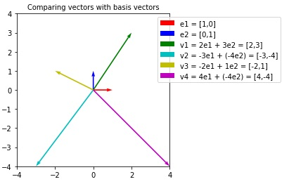

Following is an example of a vector expressed as linear combinations of its basis vectors:

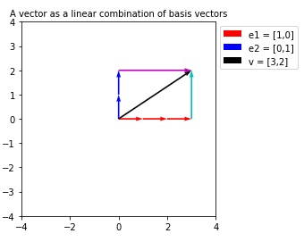

## Changing Basis
A vector space can have more than one set of basis vectors. As a vector v in vector space V is expressed as a linear combination of its basis vectors, if we change the basis vectors, the magnitude and direction of the vector will change.

Given a vector v=(1,3) in vector space R2 where e1=(1,0) and e2=(0,1) are the basis vectors.

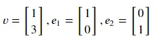

We know that,

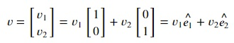

Therefore,

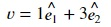

Now, new basis vectors b1 and b2 are introduced such that

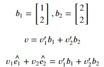

As b1 and b2 are also vectors in R2, b1 and b2 can also be expressed in the form of e1 and e2. Therefore,

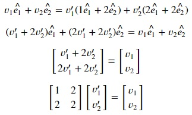

The columns of this above equation are the new basis vectors. Instead of deriving the above result every time, we can just concatenate the new basis vectors and solve the above equation to get the new coordinates of vector v for the new basis.

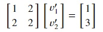

Let's solve this equation using numpy. Copy the following code to the editor:

<pre class="file" data-filename="vector.py" data-target="replace">
# Importing numpy
import numpy as np
# New basis vectors
b1 = np.array([[1],
              [2]])
b2 = np.array([[2],
              [2]])
# Vector according to the original basis
v = np.array([[1],
            [3]])
# Concatenating new basis
b = np.concatenate((b1,b2),axis=1)

# Solving for vector v according to b1 and b2
new_v = np.linalg.solve(b,v)

# Print vector according to the new basis
print("Vector v with respect to new basis vectors:")
print(new_v)
</pre>

Run `vector.py` using the following command to get results of step 1:

`python3 vector.py`{{execute}}

Therefore, for basis vectors b1 and b2, vector v can be written as:

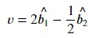

Let's see a visual representation of these vectors. Following is a plot that shows vector v with respect to its original basis vectors:

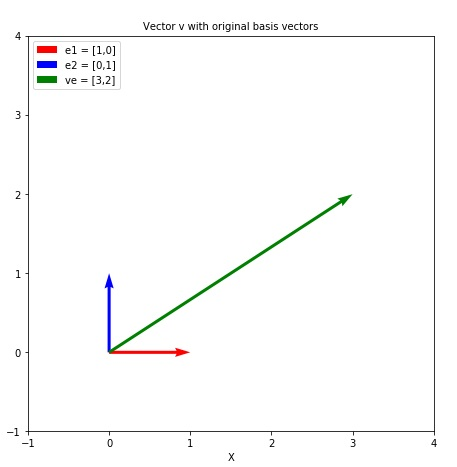

Following is a plot that shows vector v with respect to its new basis vectors:

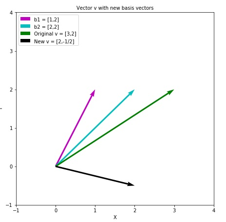