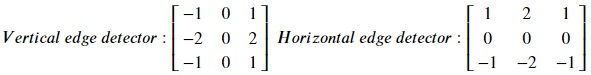
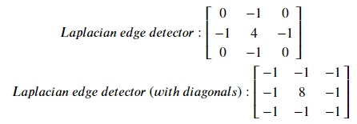

### Edge detection using convolution
We can highlight edges in our image using some special kernels. Edge detection conveys the defining(imporant) features of an image. 

##### Sobel Edge Detection
Sobel edge detection is a gradient based method where first order derivatives of an image are calculated separately for the X and Y axes. Following are the kernels for horizontal and vertical edge detection:

Let's try out both these kernels. Copy the following code to the editor:

<pre class="file" data-filename="la.py" data-target="replace">
# Importing libraries
import numpy as np
import matplotlib.pyplot as plt
from PIL import Image, ImageOps
from scipy.ndimage import convolve

# Loading image
img = Image.open("./images/img1.jpg")
# Converting to grayscale
img = ImageOps.grayscale(img) 
img.load()

# Image as a matrix
img_data = np.asarray(img, dtype="int32")

# Horizontal sobel kernel
kh = np.array([[1, 2, 1],
              [0, 0, 0],
              [-1, -2, -1]])

# Performing convolution
convolved_horizontal = convolve(img_data, kh, mode='constant', cval=1.0) 

# Plotting image 
plt.imshow(convolved_horizontal, cmap='gray', vmin=0, vmax=255)
plt.savefig("image10.jpg") # Saving image as a file

# Vertical sobel kernel
kv = np.array([[-1, 0, 1],
              [-2, 0, 2],
              [-1, 0, 1]])

# Performing convolution
convolved_vertical = convolve(img_data, kv, mode='constant', cval=1.0) 

# Plotting image 
plt.imshow(convolved_vertical, cmap='gray', vmin=0, vmax=255)
plt.savefig("image11.jpg") # Saving image as a file

# Combining both horizontal and vertical edges
combined = np.sqrt(np.square(convolved_horizontal) + np.square(convolved_vertical))

# Plotting image 
plt.imshow(combined, cmap='gray', vmin=0, vmax=255)
plt.savefig("image12.jpg") # Saving image as a file
</pre>

Run `la.py` using the following command:

`python3 la.py`{{execute}} (This code doesn't produce any output in the terminal.)

Click and open the newly formed `image10.jpg`{{open}}, `image11.jpg`{{open}} and `image12.jpg`{{open}} in the VScode sidebar to view the newly formed images. Observe how differently edges are formed in `image10` and `image11`. `image10` shows horizontal edges and `image11` shows vertical edges. `image12` shows the combined effect of these edges.

##### Laplacian Edge Detection
Unlike Sobel, Laplacian edge uses one kernel with second order derivatives. Following are the kernels for lapacian edge detection:

Let's try out both these kernels. Copy the following code to the editor:

<pre class="file" data-filename="la.py" data-target="replace">
# Importing libraries
import numpy as np
import matplotlib.pyplot as plt
from PIL import Image, ImageOps
from scipy.ndimage import convolve

# Loading image
img = Image.open("./images/img1.jpg")
# Converting to grayscale
img = ImageOps.grayscale(img) 
img.load()

# Image as a matrix
img_data = np.asarray(img, dtype="int32")

# Laplacian kernel
kl = np.array([[0, -1, 0],
              [-1, 4, -1],
              [0, -1, 0]])

# Performing convolution
laplacian = convolve(img_data, kl, mode='constant', cval=1.0) 

# Plotting image 
plt.imshow(laplacian, cmap='gray', vmin=0, vmax=255)
plt.savefig("image13.jpg") # Saving image as a file

# Laplacian kernel with diagonals
kld = np.array([[-1, -1, -1],
              [-1, 8, -1],
              [-1, -1, -1]])

# Performing convolution
laplacian_diagonal = convolve(img_data, kld, mode='constant', cval=1.0) 

# Plotting image 
plt.imshow(laplacian_diagonal, cmap='gray', vmin=0, vmax=255)
plt.savefig("image14.jpg") # Saving image as a file
</pre>

Run `la.py` using the following command:

`python3 la.py`{{execute}} (This code doesn't produce any output in the terminal.)

Click and open the newly formed `image13.jpg`{{open}} and `image14.jpg`{{open}} in the VScode sidebar to view the newly formed images. `image14` provides more edges (features) than `image13` due to the inclusion of diagonals.