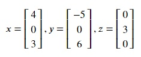
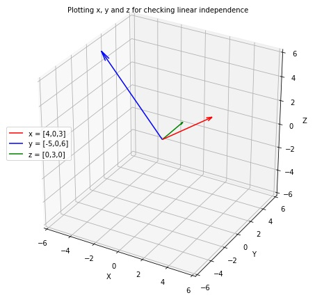

## Linear Independence
A vector is said to be linearly independent from a set of vectors or a vector space if it can't be expressed as a linear combination of that collection of vectors. For example,

For vector z to be linearly independent from vectors x and y, there should **not** exist two real numbers a and b such that

**z = ax + by**

As multiplication of any real number with zero results in zero, no combination of real numbers with the vectors can result in 3 as the second of vector c. Therefore, it is linearly independent from vectors a and b.

As you can see, vector z(i.e., the green vector) is in a direction perpendicular to both vectors x and y and not lying in the same plane as vectors x and y. Clearly, vector z is linearly independent from vectors x and y.