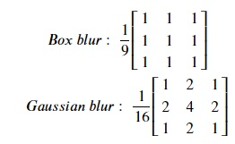

# Blurring the images
We can use kernels to blur the image. Following are two variants of these kernels:

Let's try out both these kernels. Copy the following code to the editor:

<pre class="file" data-filename="la.py" data-target="replace">
# Importing libraries
import numpy as np
import matplotlib.pyplot as plt
from PIL import Image, ImageOps
from scipy.ndimage import convolve

# Loading image
img = Image.open("./images/img1.jpg")
# Converting to grayscale
img = ImageOps.grayscale(img) 
img.load()

# Image as a matrix
img_data = np.asarray(img, dtype="int32")

# Box blur kernel
# Using 1/6 instead of 1/9 for visible difference
k = np.array([[1/6, 1/6, 1/6],
              [1/6, 1/6, 1/6],
              [1/6, 1/6, 1/6]])

# Performing convolution
bb = convolve(img_data, k, mode='constant', cval=1.0) 

# Plotting image 
plt.imshow(bb, cmap='gray', vmin=0, vmax=255)
plt.savefig("image15.jpg") # Saving image as a file

# Gaussian blur kernel
# Using 1/8 instead of 1/16 for visible difference
k = np.array([[1/8, 2/8, 1/8],
              [2/8, 4/8, 2/8],
              [1/8, 2/8, 1/8]])

# Performing convolution
gb = convolve(img_data, k, mode='constant', cval=1.0) 

# Plotting image 
plt.imshow(gb, cmap='gray', vmin=0, vmax=255)
plt.savefig("image16.jpg") # Saving image as a file
</pre>

Run `la.py` using the following command:

`python3 la.py`{{execute}} (This code doesn't produce any output in the terminal.)

Click and open `image15.jpg`{{open}} and `image16.jpg`{{open}} in the VScode sidebar to view the newly formed images. Both images are blurred and smoother than the original image with a visible loss of clarity and data.